# 分布式事物

课程目标：

1. 分布式事物产生背景(了解)
2. 分布式事物构成原理(掌握)
3. 了解2PC、3PC、TCC。掌握MQ最终一致性
4. 分布式事物实操（掌握）

## 0 背景


在分布式系统中，每个数据库会根据业务属性分别部署在不同的服务器上。相当于是先对业务进行拆分，然后在分别发送到对应业务数据存储的数据库中来存储。这样传统本地事物就无法同时对多个数据库节点来做到数据一致性的保证，所以由此就产生了分布式事物来进行解决，分布式下多个数据库节点数据存储一致性的问题。 而分布式事物的核心由分为最终一致性和强一致性。

普通的本地事务，表在数据库中，数据库在MySQL实例中，故此多个表操作，事物都可操作。

```
try {
    START TRANSACTION;
    INSERT INTO `order_main_0`.`order_0` (`id`)VALUES(1);
    INSERT INTO `order_main_0`.`order_0` (`id`)VALUES(2);
    COMMIT;
catch (Exception $e) {
    ROLLBACK;
}
```

分布式场景下，表在数据库中，数据库在不同的MySQL实例上或MySQL实例部署在不同的主机上。那每个MySQL实例连接的事物只能针对当前自己操作的数据表。

```
#mysql1：order_main_0
try {
    START TRANSACTION;
    INSERT INTO `order_main_0`.`order_0` (`id`)VALUES(1);
    COMMIT;
catch (Exception $e) {
    ROLLBACK;
}
#mysql2：order_main_0
try {
    START TRANSACTION;
    INSERT INTO `order_main_0`.`order_0` (`id`)VALUES(2);
    COMMIT;
catch (Exception $e) {
    ROLLBACK;
}
```

但是上面这种普通本地事务， 只能适用于同一个数据库服务器。

**如果我们现在做了数据库拆分。库A在服务器1上， 库B在服务器2上，上面这种方式，就不适用了。**

### 0x1 分布式事务难点

 

ACID 特性在分布式环境下变得困难：

1. 因为网络通信的不可靠，事务的原子性需要用多次日志和网络通信来保证。

2. 存储节点的增加，放大了单个存储节点在事务过程中出现故障的风险。

3. 用锁实现的事务隔离性，在故障或网络抖动时严重影响性能。

    

### 0x2 分布式事务行业主要解决方案介绍：

> 我们主要采取的是MQ事务解决方案，
>
> 我们这里对2PC，3PC，TCC等方案进行必要的介绍。


 

## 1. 2PC-两阶段提交

两阶段提交又称**2PC（two-phase commit protocol**）,2pc是一个非常经典的**强一致、中心化的原子提交协议**。这里所说的中心化是指协议中有两类节点：一个是中心化**协调者节点（coordinator）**和**N个参与者节点（partcipant）**。

在上面这个例子中如果采用两阶段提交来实现分布式事务，那么其运行原理应该是个什么样的呢？（如👇）：

**第一阶段：请求/表决阶段**

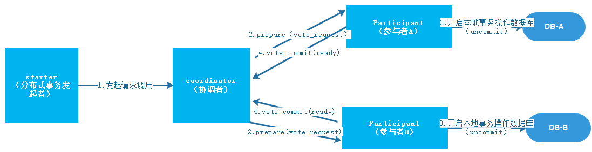

既然称为两阶段提交，说明在这个过程中是大致存在两个阶段的处理流程。第一个阶段如👆图所示，这个阶段被称之为**请求/表决阶段**。是个什么意思呢？

 

就是在分布式事务的发起方在向分布式事务协调者（Coordinator）发送请求时，Coordinator首先会分别向参与者（Partcipant）节点A、参与这节点（Partcipant）节点B分别发送**事务预处理请求**，称之为**Prepare**，有些资料也叫"**Vote Request**"。

 

说的直白点就是问一下这些参与节点"**这件事你们能不能处理成功了**"，此时这些参与者节点一般来说就会打开本地数据库事务，然后开始执行数据库本地事务，但在执行完成后并不会立马提交数据库本地事务，而是先向Coordinator报告说：“我这边可以处理了/我这边不能处理”。

 

如果所有的参与这节点都向协调者作了“**Vote Commit**”的反馈的话，那么此时流程就会进入第二个阶段了。

 

**第二阶段：提交/执行阶段（正常流程）**

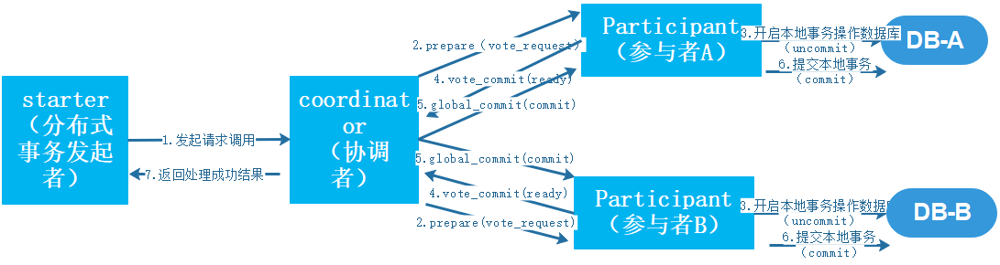

如果所有参与者节点都向协调者报告说“我这边可以处理”，那么此时协调者就会向所有参与者节点发送“**全局提交确认通知（global_commit）**”，即你们都可以进行本地事务提交了，此时参与者节点就会完成自身本地数据库事务的提交，并最终将提交结果回复“ack”消息给Coordinator，然后Coordinator就会向调用方返回分布式事务处理完成的结果。

 

**第二阶段：提交/执行阶段（异常流程）**

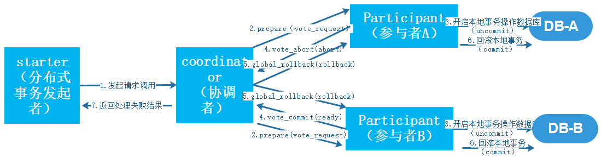

相反，在第二阶段除了所有的参与者节点都反馈“我这边可以处理了”的情况外，也会有节点反馈说“我这边不能处理”的情况发生，此时参与者节点就会向协调者节点反馈“**Vote_Abort**”的消息。此时**分布式事务协调者节点**就会向所有的参与者节点发起事务回滚的消息（“**global_rollback**”），此时各个参与者节点就会回滚本地事务，释放资源，并且向协调者节点发送“ack”确认消息，协调者节点就会向调用方返回分布式事务处理失败的结果。

 

以上就是两阶段提交的基本过程了，那么**按照这个两阶段提交协议，分布式系统的数据一致性问题就能得到满足吗**？

 

实际上**分布式事务是一件非常复杂的事情**，两阶段提交只是通过增加了事务协调者（Coordinator）的角色来通过2个阶段的处理流程来解决分布式系统中一个事务需要跨多个服务节点的数据一致性问题。但是从异常情况上考虑，**这个流程也并不是那么的无懈可击**。

 

假设如果在第二个阶段中**Coordinator**在接收到**Partcipant**的**"Vote_Request"**后挂掉了或者网络出现了异常，那么此时**Partcipant节点就会一直处于本地事务挂起的状态，从而长时间地占用资源**。当然这种情况只会出现在极端情况下，然而作为一套健壮的软件系统而言，异常Case的处理才是真正考验方案正确性的地方。

 

**以下几点是XA-两阶段提交协议中会遇到的一些问题：**

 

- **性能问题**。从流程上我们可以看得出，其最大缺点就在于它的执行过程中间，节点都处于阻塞状态。各个操作数据库的节点此时都占用着数据库资源，只有当所有节点准备完毕，事务协调者才会通知进行全局提交，参与者进行本地事务提交后才会释放资源。这样的过程会比较漫长，对性能影响比较大。
- **协调者单点故障问题**。事务协调者是整个XA模型的核心，一旦事务协调者节点挂掉，会导致参与者收不到提交或回滚的通知，从而导致参与者节点始终处于事务无法完成的中间状态。
- **丢失消息导致的数据不一致问题。**在第二个阶段，如果发生局部网络问题，一部分事务参与者收到了提交消息，另一部分事务参与者没收到提交消息，那么就会导致节点间数据的不一致问题。

 

**既然两阶段提交有以上问题，那么有没有其他的方案来解决呢？**

实战场景：用户与会员表

 


## 2. 3PC-三阶段提交

三阶段提交又称**3PC**，其在两阶段提交的基础上**增加了CanCommit阶段**，并**引入了超时机制**。一旦事务参与者迟迟没有收到协调者的Commit请求，就会自动进行本地commit，这样相对有效地解决了协调者单点故障的问题。

 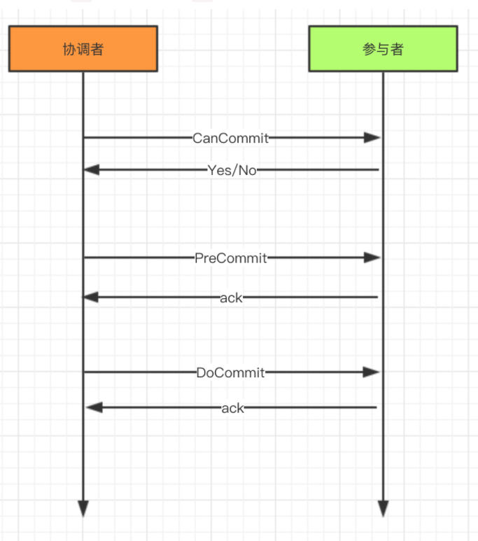

但是性能问题和不一致问题仍然没有根本解决。

在阶段一中，如果所有的参与者都返回Yes的话，那么就会进入PreCommit阶段进行事务预提交。此时分布式事务协调者会向所有的参与者节点发送PreCommit请求，参与者收到后开始执行事务操作，并将Undo和Redo信息记录到事务日志中。参与者执行完事务操作后（此时属于未提交事务的状态），就会向协调者反馈“Ack”表示我已经准备好提交了，并等待协调者的下一步指令。

 

否则，如果阶段一中有任何一个参与者节点返回的结果是No响应，或者协调者在等待参与者节点反馈的过程中超时（**2PC中只有协调者可以超时，参与者没有超时机制）**。整个分布式事务就会中断，协调者就会向所有的参与者发送**“abort”**请求。

 

相比较2PC而言，3PC对于协调者（**Coordinator**）和参与者（**Partcipant**）都设置了超时时间，而2PC只有协调者才拥有超时机制。这解决了一个什么问题呢？这个优化点，主要是避免了参与者在长时间无法与协调者节点通讯（协调者挂掉了）的情况下，无法释放资源的问题，因为参与者自身拥有超时机制会在超时后，自动进行本地commit从而进行释放资源。而这种机制也侧面降低了整个事务的阻塞时间和范围。

另外，通过**CanCommit、PreCommit、DoCommit**三个阶段的设计，相较于2PC而言，多设置了一个**缓冲阶段**保证了在最后提交阶段之前各参与节点的状态是一致的。

 

以上就是3PC相对于2PC的一个提高（相对缓解了2PC中的前两个问题），但是3PC依然没有完全解决数据不一致的问题。

3pc解决了2阶段提交的前面2个问题， 但是后面那个问题依旧没有解决


## 3. TCC-基于业务接口

 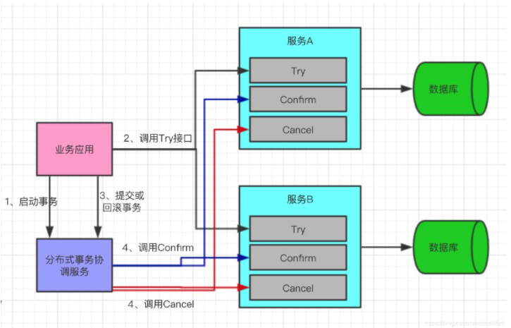

说起分布式事务的概念，不少人都会搞混淆，似乎好像分布式事务就是TCC。实际上TCC与2PC、3PC一样，只是分布式事务的一种实现方案而已。

TCC（**Try-Confirm-Cancel**）又称补偿事务。其核心思想是："针对每个操作都要注册一个与其对应的确认和补偿（撤销操作）"。它分为三个操作：

- Try阶段：主要是对业务系统做检测及资源预留。
- Confirm阶段：确认执行业务操作。 通过调用确认接口
- Cancel阶段：取消执行业务操作。 通过调用取消接口

 

TCC事务的处理流程与2PC两阶段提交类似，不过2PC通常都是在跨库的DB层面，而TCC本质上就是一个应用层面的2PC，需要通过业务逻辑来实现。这种分布式事务的实现方式的优势在于，可以让**应用自己定义数据库操作的粒度，使得降低锁冲突、提高吞吐量成为可能**。

不足之处：

1. 在于对应用的侵入性非常强，业务逻辑的每个分支都需要实现try、confirm、cancel三个操作。此外，其实现难度也比较大，需要按照网络状态、系统故障等不同的失败原因实现不同的回滚策略。为了满足一致性的要求，confirm和cancel接口还必须实现幂等。
2. 开发量很大。


## 4. MQ-最终―致性

最终一致性事务需要解决的主要难点：

生产者：

1 消息百分百投递成功

- 结合comfirm机制

消费者：

2 消息百分百消费成功

- 结合ACK机制
- 并且要解决幂等性问题

#### 4.1 confirm机制

##### 1.1 什么是Confirm机制

概念：

Pro发送消息到Broker,Broker接收到消息后,产生回送响应。Pro中有一个Confirm Listener异步监听响应应答

步骤：

- 消息的确认：Pro投递消息后,如果Broker收到消息,则会给Pro一个应答

- Pro接收应答：用来确定这条消息是否正常地发送到Broker,该法也是消息可靠性投递的核心保障!

   

##### 1.2 Confirm机制流程图

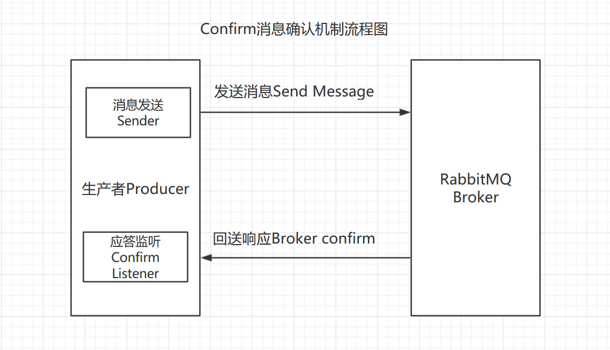

 

##### 1.3 实现Confirm机制

1. 在channel上开启确认模式：$channel->confirm_select();
2. 在channel上添加监听：$channel->wait_for_pending_acks();监听成功和失败的返回结果，根据具体的结果对消息进行重新发送、或记录日志等后续处理。

原理实操吧：

```
<?php

use PhpAmqpLib\Connection\AMQPStreamConnection;
use PhpAmqpLib\Exchange\AMQPExchangeType;
use PhpAmqpLib\Message\AMQPMessage;

include(__DIR__ . '/config.php');

$exchange = 'someExchange';

$connection = new AMQPStreamConnection(HOST, PORT, USER, PASS, VHOST);
$channel = $connection->channel();

//保存订单信息到数据库
保存订单信息到数据库的代码; //是否将信息成功推送给消息队列(is_send_succ)


//推送成功
$channel->set_ack_handler(
    function (AMQPMessage $message) {
        //update 订单表 set is_send_succ=ture
        echo "Message acked with content " . $message->body . PHP_EOL;
    }
);

//推送失败
$channel->set_nack_handler(
    function (AMQPMessage $message) {
        //update 订单表 set is_send_succ=false
        echo "Message nacked with content " . $message->body . PHP_EOL;
    }
);

/*
 * bring the channel into publish confirm mode.
 * if you would call $ch->tx_select() before or after you brought the channel into this mode
 * the next call to $ch->wait() would result in an exception as the publish confirm mode and transactions
 * are mutually exclusive
 */
$channel->confirm_select();

/*
    name: $exchange
    type: fanout
    passive: false // don't check if an exchange with the same name exists
    durable: false // the exchange won't survive server restarts
    auto_delete: true //the exchange will be deleted once the channel is closed.
*/

$channel->exchange_declare($exchange, AMQPExchangeType::FANOUT, false, false, true);

$i = 1;
$msg = new AMQPMessage($i, array('content_type' => 'text/plain'));
$channel->basic_publish($msg, $exchange);

/*
 * watching the amqp debug output you can see that the server will ack the message with delivery tag 1 and the
 * multiple flag probably set to false
 */

$channel->wait_for_pending_acks();

while ($i <= 11) {
    $msg = new AMQPMessage($i++, array('content_type' => 'text/plain'));
    $channel->basic_publish($msg, $exchange);
}

/*
 * you do not have to wait for pending acks after each message sent. in fact it will be much more efficient
 * to wait for as many messages to be acked as possible.
 */
$channel->wait_for_pending_acks();

$channel->close();
$connection->close();
```

#### 4.2 保证消息的百分百投递成功

##### 4.2.1 Producer 的可靠性投递

###### 4.2.1.1 要求

- 保证消息的成功发出
- 保证MQ节点的成功接收
- 发送端收到MQ节点(Broker) 确认应答
- 完善的消息补偿机制

在实际生产中，很难保障前三点的完全可靠，比如在极端的环境中，生产者发送消息失败了，发送端在接受确认应答时突然发生网络闪断等等情况，很难保障可靠性投递，所以就需要有第四点完善的消息补偿机制。


###### 4.2.1.2 解决方案

**4.2.1.2.1 方案一:消息信息落库,对消息状态进行打标(常见方案)**

将消息持久化到DB并设置状态值,收到Consumer的应答就改变当前记录的状态，再轮询重新发送没接收到应答的消息。注意这里要设置重试次数.

方案流程图

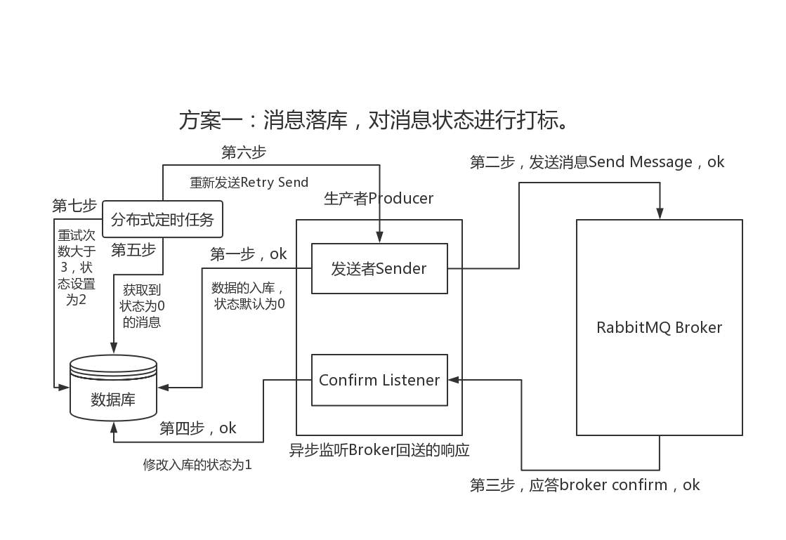

##### 方案实现流程

比如我下单成功

step1 - 对订单数据入BIZ DB订单库,并对因此生成的业务消息入MSG DB消息库

此处由于采用了两个数据库,需要两次持久化操作,为了保证数据的一致性,有人可能就想着采用分布式事务,但在大厂实践中,基本都是采用补偿机制!

> 这里一定要保证step1 中消息都存储成功了，没有出现任何异常情况，然后生产端再进行消息发送。如果失败了就进行快速失败机制

对业务数据和消息入库完毕就进入 

setp2 - 发送消息到 MQ 服务上，如果一切正常无误消费者监听到该消息，进入

step3 - 生产端有一个`Confirm Listener`,异步监听Broker回送的响应,从而判断消息是否投递成功

- step4 - 如果成功,去数据库查询该消息,并将消息状态更新为1
- step5 - 如果出现意外情况，消费者未接收到或者 Listener 接收确认时发生网络闪断，导致生产端的Listener就永远收不到这条消息的confirm应答了，也就是说这条消息的状态就一直为0了，这时候就需要用到我们的分布式定时任务来从 MSG 数据库抓取那些超时了还未被消费的消息，重新发送一遍  此时我们需要设置一个规则，比如说消息在入库时候设置一个临界值timeout，5分钟之后如果还是0的状态那就需要把消息抽取出来。这里我们使用的是分布式定时任务，去定时抓取DB中距离消息创建时间超过5分钟的且状态为0的消息。

step6 - 把抓取出来的消息进行重新投递(Retry Send)，也就是从第二步开始继续往下走

step7 - 当然有些消息可能就是由于一些实际的问题无法路由到Broker，比如routingKey设置不对，对应的队列被误删除了，那么这种消息即使重试多次也仍然无法投递成功，所以需要对重试次数做限制，比如限制3次，如果投递次数大于三次，那么就将消息状态更新为2，表示这个消息最终投递失败,然后通过补偿机制，人工去处理。实际生产中，这种情况还是比较少的，但是你不能没有这个补偿机制，要不然就做不到可靠性了。

方案核心代码

```
<?php

use PhpAmqpLib\Connection\AMQPStreamConnection;
use PhpAmqpLib\Exchange\AMQPExchangeType;
use PhpAmqpLib\Message\AMQPMessage;

include(__DIR__ . '/config.php');

$exchange = 'someExchange';

$connection = new AMQPStreamConnection(HOST, PORT, USER, PASS, VHOST);
$channel = $connection->channel();

$channel->set_ack_handler(
    function (AMQPMessage $message) {
        echo "Message acked with content " . $message->body . PHP_EOL;
    }
);

$channel->set_nack_handler(
    function (AMQPMessage $message) {
        echo "Message nacked with content " . $message->body . PHP_EOL;
    }
);

/*
 * bring the channel into publish confirm mode.
 * if you would call $ch->tx_select() before or after you brought the channel into this mode
 * the next call to $ch->wait() would result in an exception as the publish confirm mode and transactions
 * are mutually exclusive
 */
$channel->confirm_select();

/*
    name: $exchange
    type: fanout
    passive: false // don't check if an exchange with the same name exists
    durable: false // the exchange won't survive server restarts
    auto_delete: true //the exchange will be deleted once the channel is closed.
*/

$channel->exchange_declare($exchange, AMQPExchangeType::FANOUT, false, false, true);

$i = 1;
$msg = new AMQPMessage($i, array('content_type' => 'text/plain'));
$channel->basic_publish($msg, $exchange);

/*
 * watching the amqp debug output you can see that the server will ack the message with delivery tag 1 and the
 * multiple flag probably set to false
 */

$channel->wait_for_pending_acks();

while ($i <= 11) {
    $msg = new AMQPMessage($i++, array('content_type' => 'text/plain'));
    $channel->basic_publish($msg, $exchange);
}

/*
 * you do not have to wait for pending acks after each message sent. in fact it will be much more efficient
 * to wait for as many messages to be acked as possible.
 */
$channel->wait_for_pending_acks();

$channel->close();
$connection->close();
```

缺点是：在第一步需要更新或者插入操作数据库2次

在大厂中 都不会加事务，都是进行的补偿操作。

优化：不需要消息进行持久化 只需要业务持久化


**4.2.1.2.1 方案二:消息的延迟投递，做二次确认，回调检查（不常用，大厂在用的高并发方案）**

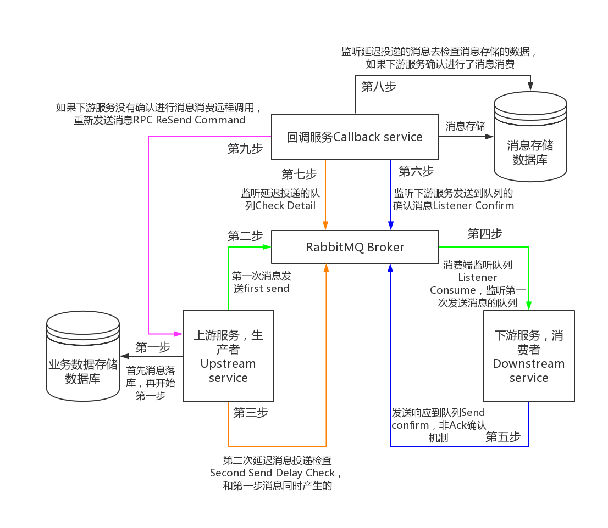

第一步：（上游服务：Upstream service）业务入库  然后send 消息到broker这两步是有先后顺序的

然后再第二步进行消息延迟发送到新的queue（延迟时间为5分钟：业务决定）

第三步（下游服务：Downstream service）监听到消息然后处理消息

第四步 下游服务send confirm生成新的消息到broker （这里是一个新的queue）

第五步 callback service  去监听这个消息 并且入库 如果监听到表示这个消息已经消费成功

第六步 callback service 去检查 第二步投递的延迟消息是否 在msgDB里面是否消费成功，不存在或者消费失败就会 Resend command

 

如果在第1,2,4步失败 ，如果成功 broker会给我们一个confirm，失败当然没有，这是消息可靠性投递的重要保障


#### 4.3 幂等性

##### 3.1 什么是幂等性

用户对于同一操作发起的一次请求或者多次请求的结果是一致的

比如数据库的乐观锁,在执行更新操作前,先去数据库查询version,然后执行更新语句,以version作为条件,如果执行更新时有其他人先更新了这张表的数据,那么这个条件就不生效了,也就不会执行操作了,通过这种乐观锁的机制来保障幂等性.

##### 3.2 Con - 幂等性

###### 3.2.1 什么是Con - 幂等性

在业务高峰期最容易产生消息重复消费问题,当Con消费完消息时,在给Pro返回ack时由于网络中断,导致Pro未收到确认信息,该条消息就会重新发送并被Con消费,但实际上该消费者已成功消费了该条消息,这就造成了重复消费.

而Con - 幂等性，即消息不会被多次消费,即使我们收到了很多一样的消息.

###### 3.2.2 主流幂等性实现方案

**3.2.2.1 唯一ID+指纹码**

**核心:利用数据库主键去重**

- 唯一ID:业务表的主键

- 指纹码：为了区别每次正常操作的码，每次操作时生成指纹码；可以用时间戳+业务编号或者标志位（具体视业务场景而定） 

  

- 优势 实现简单

- 弊端 高并发下有数据库写入的性能瓶颈

- 解决方案 根据ID进行分库分表算法路由

**小结**

首先我们需要根据消息生成一个全局唯一ID，然后还需要加上一个指纹码。这个指纹码它并不一定是系统去生成的，而是一些外部的规则或者内部的业务规则去拼接，它的目的就是为了保障这次操作是绝对唯一的。

将ID + 指纹码拼接好的值作为数据库主键，就可以进行去重了。即在消费消息前呢，先去数据库查询这条消息的指纹码标识是否存在，没有就执行insert操作，如果有就代表已经被消费了，就不需要管了


#### 4.4 Return机制

##### 4.1 什么是Return机制

Return Listener用于处理一些不可路由的消息。也是生产段添加的一个监听。

我们的消息生产者，通过指定一个Exchange和Routingkey，把消息送达到某一个队列中去，然后我们的消费者监听队列，进行消息处理操作。但是在某些情况下，如果我们在发送消息的时候，当前的exchange不存在或者指定的路由key路由不到，这个时候如果我们需要监听这种不可达的消息，就要使用Return Listener。

 

##### 4.2 图解Return机制

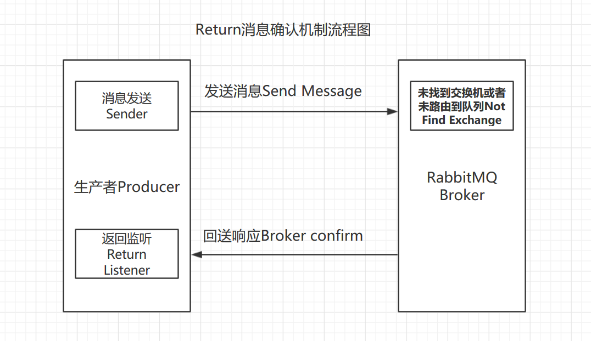

##### 4.3 实现Return机制

```
<?php

require_once __DIR__ . '/../vendor/autoload.php';

use PhpAmqpLib\Connection\AMQPStreamConnection;
use PhpAmqpLib\Exchange\AMQPExchangeType;
use PhpAmqpLib\Message\AMQPMessage;

$connection = new AMQPStreamConnection('localhost', 5672, 'guest', 'guest');
$channel = $connection->channel();

// declare  exchange but don`t bind any queue
$channel->exchange_declare('hidden_exchange', AMQPExchangeType::TOPIC);

$message = new AMQPMessage("Hello World!");

echo " [x] Sent non-mandatory ...";
$channel->basic_publish(
    $message,
    'hidden_exchange',
    'rkey'
);
echo " done.\n";

$wait = true;

$returnListener = function (
    $replyCode,
    $replyText,
    $exchange,
    $routingKey,
    $message
) use ($wait) {
    $GLOBALS['wait'] = false;

    echo "return: ",
    $replyCode, "\n",
    $replyText, "\n",
    $exchange, "\n",
    $routingKey, "\n",
    $message->body, "\n";
};

$channel->set_return_listener($returnListener);

echo " [x] Sent mandatory ... ";
$channel->basic_publish(
    $message,
    'hidden_exchange',
    'rkey',
    true
);
echo " done.\n";

while ($wait) {
    $channel->wait();
}

$channel->close();
$connection->close();
```

 

#### 4.5 Con - ACK & 重回队列机制

##### 4.5.1 ACK & NACK

当我们设置

```
autoACK=false
```

时,就可以使用手工ACK方式了,其实手工方式包括了手工ACK与NACK，当我们手工 ACK 时,会发送给Broker一个应答,代表消息处理成功,Broker就可回送响应给Pro。 NACK 则表示消息处理失败,如果设置了重回队列,Broker端就会将没有成功处理的消息重新发送.

### 4.5.2 使用方式

- Con消费时,如果由于业务异常,我们可以手工 NACK 记录日志,然后进行补偿API：void basicNack(long deliveryTag, boolean multiple, boolean requeue)API：void basicAck(long deliveryTag, boolean multiple)
- 如果由于服务器宕机等严重问题,我们就需要手工 ACK 保障Con消费成功

##### 4.5.2.1 重回队列

- 重回队列是为了对没有处理成功的消息,将消息重新投递给Broker
- 重回队列,会把消费失败的消息重新添加到队列的尾端,供Con继续消费
- 一般在实际应用中,都会关闭重回队列,即设置为false


##### 4.5.2.2 实现机制

- 代码

  ```
  <?php
  ```

  ```
  /**
  ```

  ```
   * - Start this consumer in one window by calling: php demo/basic_nack.php
  ```

  ```
   * - Then on a separate window publish a message like this: php demo/amqp_publisher.php good
  ```

  ```
   *   that message should be "ack'ed"
  ```

  ```
   * - Then publish a message like this: php demo/amqp_publisher.php bad
  ```

  ```
   *   that message should be "nack'ed"
  ```

  ```
   */
  ```

  ```
  include(__DIR__ . '/config.php');
  ```

  ```
  
  ```

  ```
  use PhpAmqpLib\Connection\AMQPStreamConnection;
  ```

  ```
  use PhpAmqpLib\Exchange\AMQPExchangeType;
  ```

  ```
  
  ```

  ```
  $exchange = 'router';
  ```

  ```
  $queue = 'msgs';
  ```

  ```
  $consumerTag = 'consumer';
  ```

  ```
  
  ```

  ```
  $connection = new AMQPStreamConnection(HOST, PORT, USER, PASS, VHOST);
  ```

  ```
  $channel = $connection->channel();
  ```

  ```
  
  ```

  ```
  $channel->queue_declare($queue, false, true, false, false);
  ```

  ```
  $channel->exchange_declare($exchange, AMQPExchangeType::DIRECT, false, true, false);
  ```

  ```
  $channel->queue_bind($queue, $exchange);
  ```

  ```
  
  ```

  ```
  /**
  ```

  ```
   * @param \PhpAmqpLib\Message\AMQPMessage $message
  ```

  ```
   */
  ```

  ```
  function process_message($message)
  ```

  ```
  {
  ```

  ```
      if ($message->body == 'good') {
  ```

  ```
          $message->ack();
  ```

  ```
      } else {
  ```

  ```
          echo "成功收到消息，消息内容为：".$message->body ;
  ```

  ```
          echo "将消息打回,重回队列：";
  ```

  ```
          $message->nack(true);
  ```

  ```
      }
  ```

  ```
  
  ```

  ```
      // Send a message with the string "quit" to cancel the consumer.
  ```

  ```
      if ($message->body === 'quit') {
  ```

  ```
          $message->getChannel()->basic_cancel($message->getConsumerTag());
  ```

  ```
      }
  ```

  ```
  }
  ```

  ```
  
  ```

  ```
  $channel->basic_consume($queue, $consumerTag, false, false, false, false, 'process_message');
  ```

  ```
  
  ```

  ```
  /**
  ```

  ```
   * @param \PhpAmqpLib\Channel\AMQPChannel $channel
  ```

  ```
   * @param \PhpAmqpLib\Connection\AbstractConnection $connection
  ```

  ```
   */
  ```

  ```
  function shutdown($channel, $connection)
  ```

  ```
  {
  ```

  ```
      $channel->close();
  ```

  ```
      $connection->close();
  ```

  ```
  }
  ```

  ```
  
  ```

  ```
  register_shutdown_function('shutdown', $channel, $connection);
  ```

  ```
  
  ```

  ```
  // Loop as long as the channel has callbacks registered
  ```

  ```
  while ($channel->is_consuming()) {
  ```

  ```
      $channel->wait();
  ```

  ```
  }
  ```

- 执行上面代码

  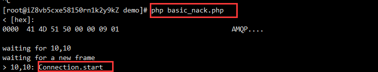

- 执行成功后，会生成一个队列，打开管控台，如下图所示，发现生成了一个名为msg的队列：

  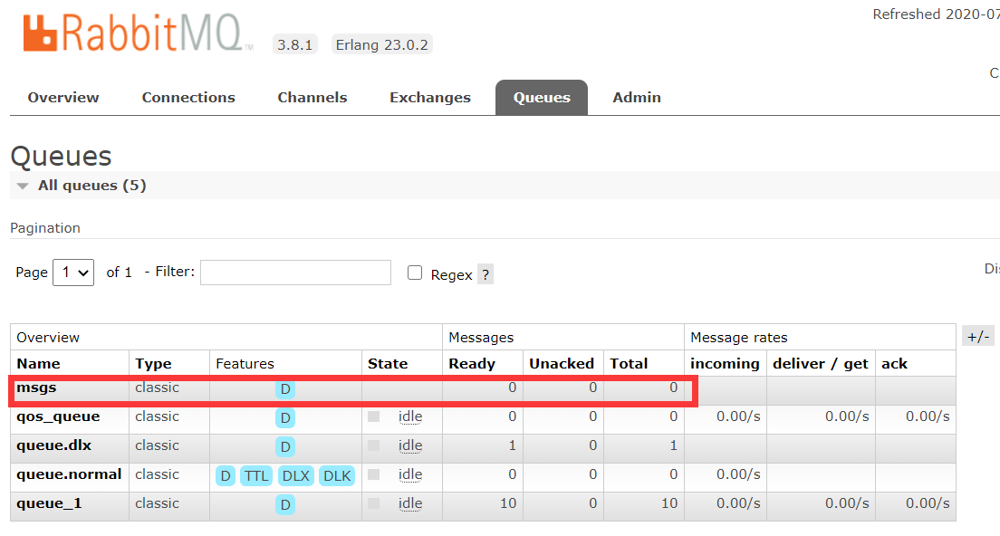

- 我们往队列里面添加一条消息，如下图，输入消息内容后，点击 publish按钮提交

  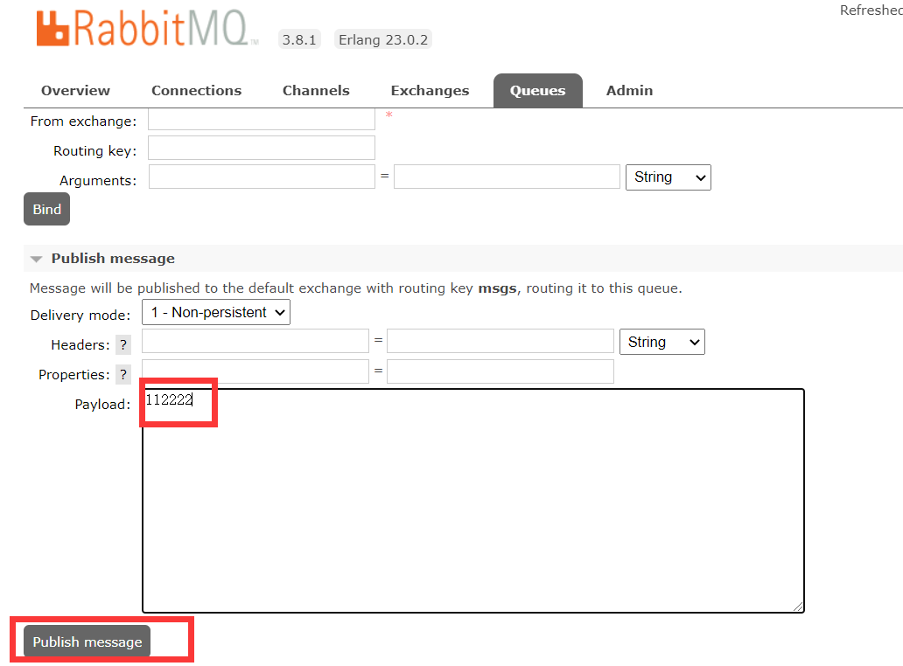

   

- 查看管控台 ，如下图发现多了一条消息，说明刚刚我们添加消息成功

  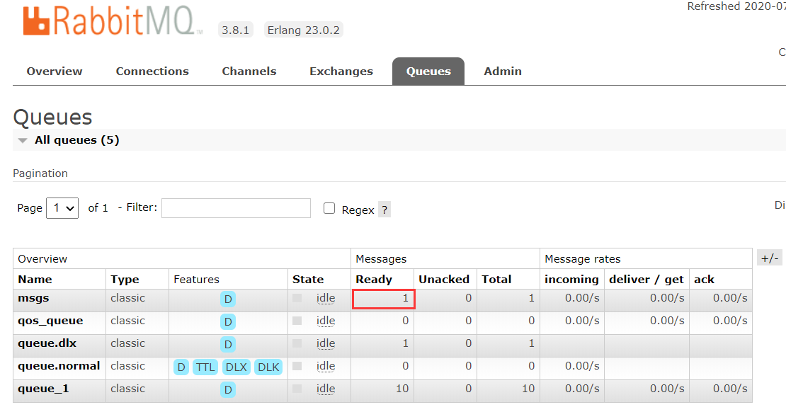

- 进入linux界面， 发现这条消息一直在循环接收。

  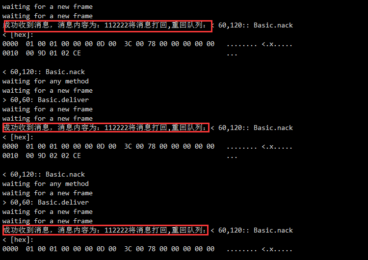

   

  循环接收的原因：这条消息由于我们调用了NACK，并且设置了重回队列（如下图对代码的讲解所示）所以会导致该条消息一直重复发送，消费端就会一直循环消费

  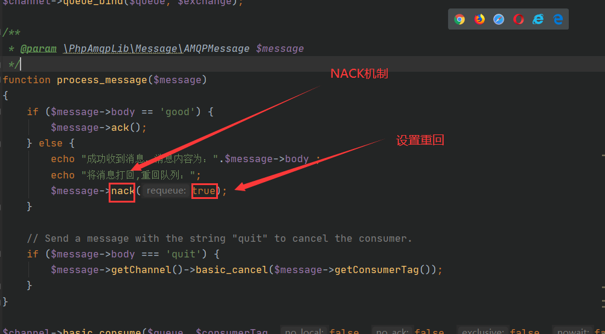


### 5 TTL

#### 5.1 什么是TTL

- TTL(Time To Live),即生存时间
- RabbitMQ支持消息的过期时间，在消息发送时可以进行指定
- RabbitMQ支持为每个队列设置消息的超时时间，从消息入队列开始计算，只要超过了队列的超时时间配置，那么消息会被自动清除

#### 5.2 实现TTL

- 实现代码

  ```
  // 消息过期方式：设置 queue.normal 队列中的消息10s之后过期
  ```

  ```
  $args->set('x-message-ttl', 10000);
  ```

   

- 课堂演示执行代码

  ```
  <?php
  ```

  ```
  include(__DIR__ . '/config.php');
  ```

  ```
  use PhpAmqpLib\Wire\AMQPTable;
  ```

  ```
  use PhpAmqpLib\Message\AMQPMessage;
  ```

  ```
  use PhpAmqpLib\Exchange\AMQPExchangeType;
  ```

  ```
  use PhpAmqpLib\Connection\AMQPStreamConnection;
  ```

  ```
  
  ```

  ```
  /**
  ```

  ```
  
  ```

  ```
  - 死信队列测试
  ```

  ```
  - 1、创建两个交换器 exchange.normal 和 exchange.dlx, 分别绑定两个队列 queue.normal 和 queue.dlx
  ```

  ```
  - 2、把 queue.normal 队列里面的消息配置过期时间，然后通过 x-dead-letter-exchange 指定死信交换器为 exchange.dlx
  ```

  ```
  - 3、发送消息到 queue.normal 中，消息过期之后流入 exchange.dlx，然后路由到 queue.dlx 队列中，进行消费
  ```

  ```
    */
  ```

  ```
  
  ```

  ```
  // todo 更改配置
  ```

  ```
  //$connection = new AMQPStreamConnection('192.168.33.1', 5672, 'zhangcs', 'zhangcs', '/');
  ```

  ```
  $connection = new AMQPStreamConnection(HOST, PORT, USER, PASS, VHOST);
  ```

  ```
  
  ```

  ```
  $channel = $connection->channel();
  ```

  ```
  
  ```

  ```
  $channel->exchange_declare('exchange.dlx', AMQPExchangeType::DIRECT, false, true);
  ```

  ```
  $channel->exchange_declare('exchange.normal', AMQPExchangeType::FANOUT, false, true);
  ```

  ```
  $args = new AMQPTable();
  ```

  ```
  // 消息过期方式：设置 queue.normal 队列中的消息10s之后过期
  ```

  ```
  $args->set('x-message-ttl', 10000);
  ```

  ```
  // 设置队列最大长度方式： x-max-length
  ```

  ```
  //$args->set('x-max-length', 1);
  ```

  ```
  $args->set('x-dead-letter-exchange', 'exchange.dlx');
  ```

  ```
  $args->set('x-dead-letter-routing-key', 'routingkey');
  ```

  ```
  $channel->queue_declare('queue.normal', false, true, false, false, false, $args);
  ```

  ```
  $channel->queue_declare('queue.dlx', false, true, false, false);
  ```

  ```
  
  ```

  ```
  $channel->queue_bind('queue.normal', 'exchange.normal');
  ```

  ```
  $channel->queue_bind('queue.dlx', 'exchange.dlx', 'routingkey');
  ```

  ```
  $message = new AMQPMessage('Hello DLX Message');
  ```

  ```
  $channel->basic_publish($message, 'exchange.normal', 'rk');
  ```

  ```
  
  ```

  ```
  $channel->close();
  ```

  ```
  $connection->close();
  ```

   

- 立马打开管控台，可以看到生成了1条消息

  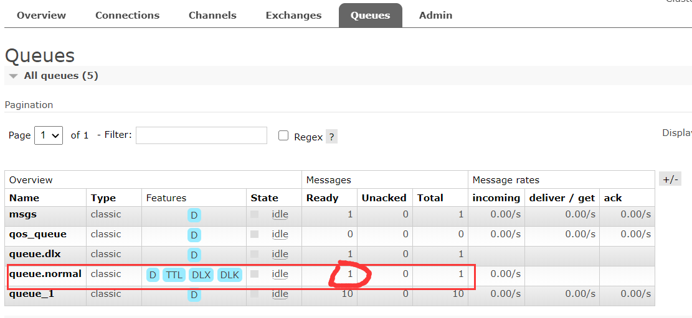

- 10秒后，发现消息不见了：

  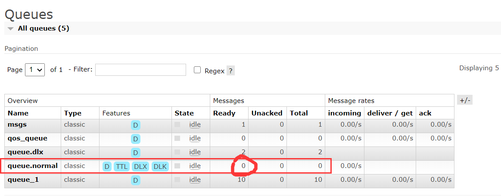

   


### 6 死信队列机制

 

#### 6.1 什么是死信队列

DLX - 死信队列(dead-letter-exchange) 利用DLX,当消息在一个队列中变成死信 (dead message) 之后,它能被重新publish到另一个Exchange中,这个Exchange就是DLX.

 

#### 6.2 死信队列的产生场景

消息被拒绝(basic.reject / basic.nack),并且requeue = false 消息因TTL过期 队列达到最大长度

 

#### 6.3 死信的处理过程

DLX亦为一个普通的Exchange,它能在任何队列上被指定,实际上就是设置某个队列的属性 当某队列中有死信时,RabbitMQ会自动地将该消息重新发布到设置的Exchange,进而被路由到另一个队列 可以监听这个队列中的消息做相应的处理.该特性可以弥补RabbitMQ 3.0以前支持的immediate参数的功能 

 

#### 6.4 死信队列的配置

设置死信队列的exchange和queue,然后进行绑定 - Exchange:dlx.exchange - Queue: dlx.queue - RoutingKey:# 正常声明交换机、队列、绑定，只不过我们需要在队列加上一个参数即可arguments.put(" x-dead-letter-exchange"，"dlx.exchange");

这样消息在过期、requeue、 队列在达到最大长度时，消息就可以直接路由到死信队列！

#### 6.5 实操演示

```
<?php
include(__DIR__ . '/config.php');
use PhpAmqpLib\Wire\AMQPTable;
use PhpAmqpLib\Message\AMQPMessage;
use PhpAmqpLib\Exchange\AMQPExchangeType;
use PhpAmqpLib\Connection\AMQPStreamConnection;

/**
- 死信队列测试
- 1、创建两个交换器 exchange.normal 和 exchange.dlx, 分别绑定两个队列 queue.normal 和 queue.dlx
- 2、把 queue.normal 队列里面的消息配置过期时间，然后通过 x-dead-letter-exchange 指定死信交换器为 exchange.dlx
- 3、发送消息到 queue.normal 中，消息过期之后流入 exchange.dlx，然后路由到 queue.dlx 队列中，进行消费
  */

// todo 更改配置
//$connection = new AMQPStreamConnection('192.168.33.1', 5672, 'zhangcs', 'zhangcs', '/');
$connection = new AMQPStreamConnection(HOST, PORT, USER, PASS, VHOST);

$channel = $connection->channel();

$channel->exchange_declare('exchange.dlx', AMQPExchangeType::DIRECT, false, true);
$channel->exchange_declare('exchange.normal', AMQPExchangeType::FANOUT, false, true);
$args = new AMQPTable();
// 消息过期方式：设置 queue.normal 队列中的消息10s之后过期
$args->set('x-message-ttl', 10000);
// 设置队列最大长度方式： x-max-length
//$args->set('x-max-length', 1);
$args->set('x-dead-letter-exchange', 'exchange.dlx');
$args->set('x-dead-letter-routing-key', 'routingkey');
$channel->queue_declare('queue.normal', false, true, false, false, false, $args);
$channel->queue_declare('queue.dlx', false, true, false, false);

$channel->queue_bind('queue.normal', 'exchange.normal');
$channel->queue_bind('queue.dlx', 'exchange.dlx', 'routingkey');
$message = new AMQPMessage('Hello DLX Message');
$channel->basic_publish($message, 'exchange.normal', 'rk');

$channel->close();
$connection->close();
```

 

- 配置死信队列

  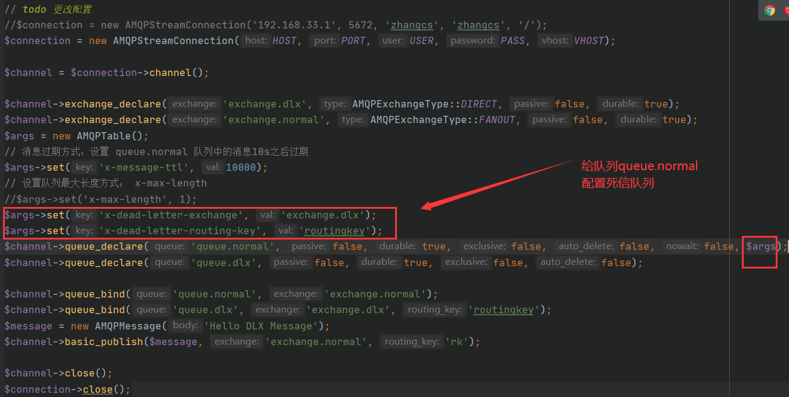

- 执行

  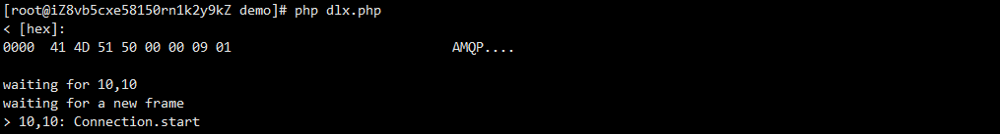

- 立马查看管控台，发现队列queue.normal里面有1条消息， 死信队列 queue.dlx里面没有信息

  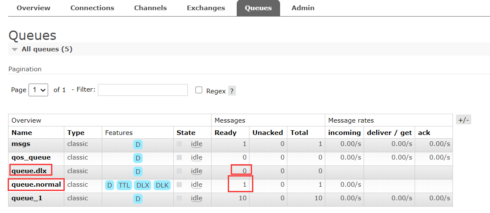

- 10秒之后,再去查看管控台， 发现队列queue.normal里面没有消息了， 而死信队列 queue.dlx里面多了一条信息

  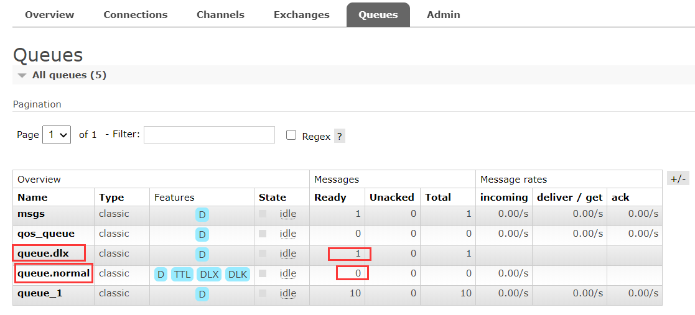

- 为什么会这样变化呢， 因为queue.normal里面的消息，生存时间为10秒，并且配置了一个名为queue.dlx的死信队列，所以queue.normal里面的消息10秒后进入了死信队列queue.dlx。

 

## 7 分布式事物实战

### 7.1 业务分析

下单后，下单库与下单统计库之间的分布式事务问题的由来，见下图：

 

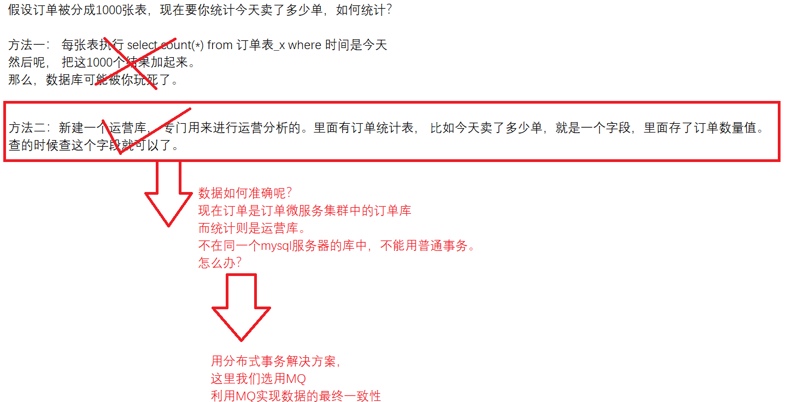

 

 

 

 

> 1 用户下单这个操作，后端把信息存入下单库，把消息推入MQ，然后回复前端下单用户，告诉他下单成功。
>
> 2 之后， 统计脚本把消息从MQ里面读取出来，并修改统计库，把订单下单量这个字段的值+1
>
> 3 上面2点，关联到2个库，数据如何保持一致呢？ 

 

大家知道，如果是同一个库， 我们是可以用mysql普通事务的，但是现在跨服务，是不同的数据库了，所以得用分布式事务。

本课我们借助rabbimq来实现事务的最终一致性。


### 7.2 本课大致设计分析

回顾：下图是上节课的一份关于下单与派单的分布式事务设计分析图。简单回顾，具体内容见上节课

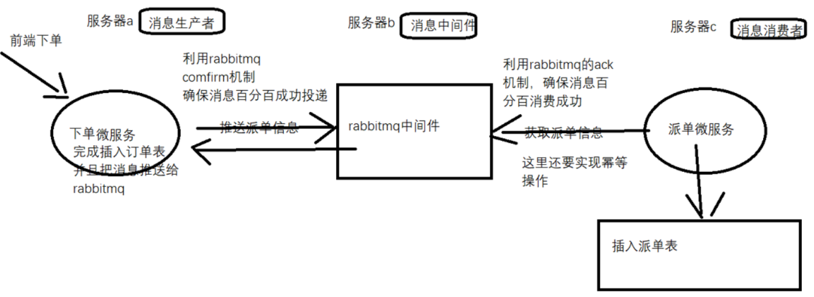

 

**我们是商城系统， 本课我们选用下单与下单统计之间的分布式事务作为演示**

 

 

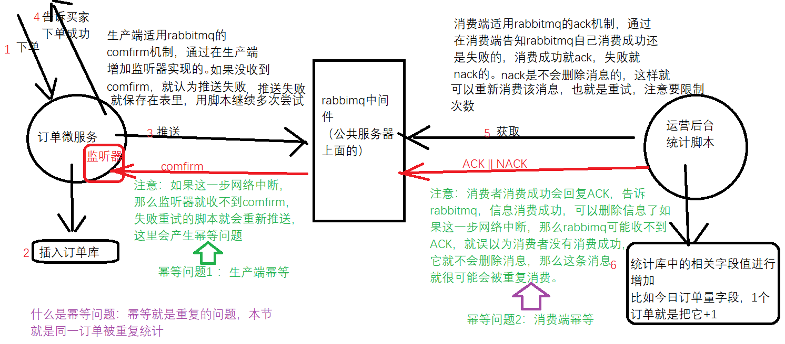

 

 

### 7.3 整体代码流程图

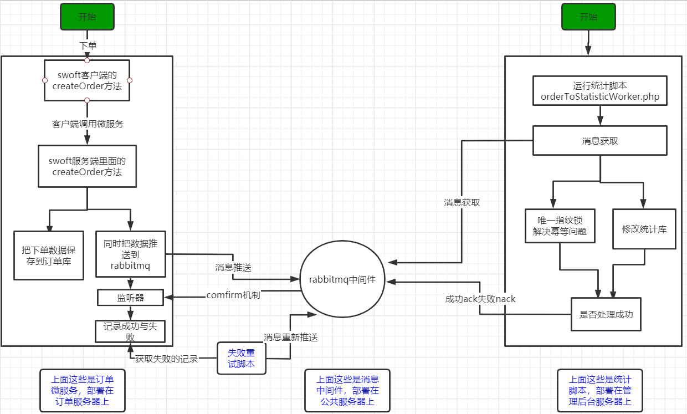

 

图[4-0]

 

### 7.4 部分代码细节

#### 7.4.1 修改订单微服务中的createOrder方法

> 这个方法是用户下单的方法
>
> 里面主要包括了上图（图[4-0]）中的以下逻辑：
>
> 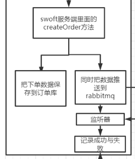

 

```
public function createOrder(): array
{

    /*插入数据到订单表*/     /*实际场景中，这里要加事务*/
    $diff_struts_db = new \App\Components\Order\DiffStrutsDb();
    $insert_result = $diff_struts_db->insert(['data'=>['id'=>time()]]);


    /*
    消息推送到rabbitmq
    */
    $exchange = 'exchange_1';
    $queue = 'order_satistic_queue';

    //获得rabbitmq集群配置
    $config = bean('config')->get('rabbitmq.rabbitmq_1');

    //连接broker,创建一个rabbitmq连接
    $connection = new AMQPStreamConnection($config['host'], $config['port'], $config['login'], $config['password'], $config['vhost']);

    //创建一个通道
    $channel = $connection->channel();

    /*这个代码是rabbitmq高级特性：comfirm机制*/
    /*监听器*/
    //监听到推送成功就：
    $channel->set_ack_handler(
        function (AMQPMessage $message) {
            //update 订单表 set is_send_succ=ture
            echo "Message acked with content " . $message->body . PHP_EOL;

            /*这里省略以下逻辑（失败重试逻辑）：*/
            //把推送成功的记录起来。
            //插入到订单推送状态表，推送状态字段默认是0，推送成功才会把这个字段修改为1，推送失败这个字段的值就是0
            /*还要写一个脚本，去重试失败记录，也就是重试哪些推送状态字段的值是0的记录*/
        }
    );

    //监听到推送失败就：
    $channel->set_nack_handler(
        function (AMQPMessage $message) {
            //update 订单表 set is_send_succ=false
            echo "Message nacked with content " . $message->body . PHP_EOL;

            /*这里省略以下逻辑（失败重试逻辑）：*/
            //把推送失败的记录起来。
            //插入到订单推送状态表，推送状态字段默认是0，推送成功才会把这个字段修改为1，推送失败这个字段的值就是0
            /*还要写一个脚本，去重试失败记录，也就是重试哪些推送状态字段的值是0的记录*/
        }
    );

    //申明comfirm机制
    $channel->confirm_select();

    //申明队列
    $channel->queue_declare($queue, false, true, false, false);

    //申明交换机
    $channel->exchange_declare($exchange, AMQPExchangeType::FANOUT, false, false, true);
    //将交换机和队列绑定
    $channel->queue_bind($queue, $exchange);

    /*写死一条测试消息*/
    $messageBody = json_encode( [['sku_id'=>123,'num'=>2,'type'=>'crateOrder','order_no'=>'T3433335']]);

    /*把消息转化成rabbitmq消息格式*/
    $message = new AMQPMessage($messageBody, array('content_type' => 'text/plain', 'delivery_mode' => AMQPMessage::DELIVERY_MODE_PERSISTENT));

    /*推送这条消息*/
    $channel->basic_publish($message, $exchange);

    $channel->wait_for_pending_acks(3);
    $channel->close();
    $connection->close();

    return [[$insert_result]];
```