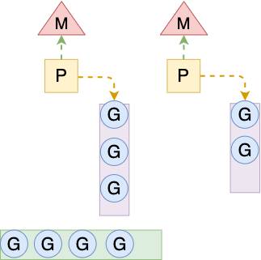
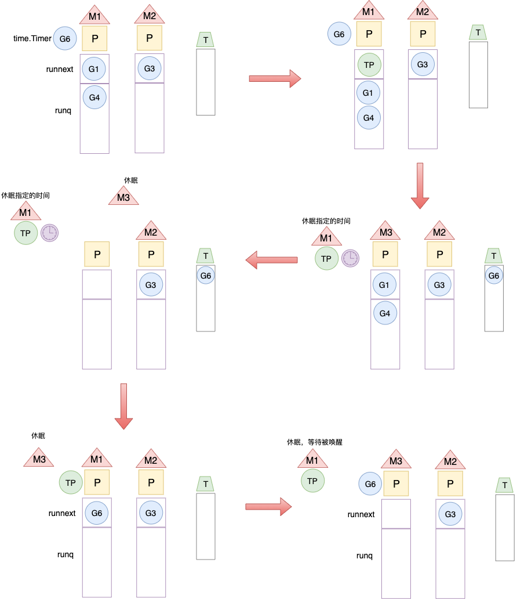
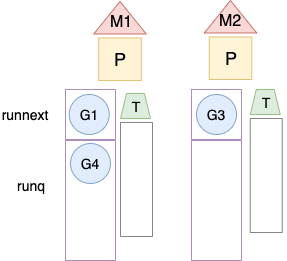

摘自：

https://studygolang.com/articles/26529

https://studygolang.com/articles/27107

完整变化可查看：https://go.dev/doc/go1.14

# 1. 性能提升

## 1.1 defer性能提示

```go
package go_test

import (
    "testing"
)

type channel chan int

func NoDefer() {
    ch1 := make(channel, 10)
    close(ch1)
}

func Defer() { 
    ch2 := make(channel, 10)
    defer close(ch2)
}

func BenchmarkNoDefer(b *testing.B) {
    for i := 0; i < b.N; i++ {
        NoDefer()
    }
}

func BenchmarkDefer(b *testing.B) {
    for i := 0; i < b.N; i++ {
        Defer()
    }
}
```

运行结果如下

```shell
[root@5CG026B3DH go_test]# gvm use go1.13
Now using version go1.13
[root@5CG026B3DH go_test]# go -- version
go version go1.13 linux/amd64
[root@5CG026B3DH go_test]# go test -bench=. -v
goos: linux
goarch: amd64
pkg: go_test/go_test
BenchmarkNoDefer-8      16710158                67.1 ns/op
BenchmarkDefer-8        10575314               104 ns/op
PASS
ok      go_test/go_test 2.420s
```

go1.13 defer关闭channel性能开销还是蛮大的，接下来看go1.14版本测试结果

```shell
[root@5CG026B3DH go_test]# go test -bench=. -v
goos: linux
goarch: amd64
pkg: go_test/go_test
BenchmarkNoDefer
BenchmarkNoDefer-8      16032642                70.1 ns/op
BenchmarkDefer
BenchmarkDefer-8        15448786                72.5 ns/op
PASS
ok      go_test/go_test 2.405s
```

对比发现，defer对关闭channel的性能开销几乎可以忽略

我们知道，1.13对于defer就做了很大的优化，那么到底针对defer做了哪些修改，可以参考以下几篇文章

- [深入理解defer上](https://zhuanlan.zhihu.com/p/68702577)
- [深入理解defer实现机制下](https://zhuanlan.zhihu.com/p/69455275)
- [Go1.13 defer性能是如何提高的](https://mp.weixin.qq.com/s?__biz=MzA4ODg0NDkzOA==&mid=2247487138&idx=2&sn=7d335d738b1da2806f1f8a29d624553e&source=41#wechat_redirect)
- [Go1.14实现defer性能大幅度提升原理](http://xiaorui.cc/archives/6579)


## 1.2 goroutine 支持异步抢占

Go语言调度器的性能随着版本迭代表现的越来越优异，我们来了解一下调度器使用的G-M-P模型。先是一些概念：

- G（Goroutine）： goroutine，由关键字go创建
- M（Machine）： 在Go中称为Machine，可以理解为工作线程
- P（Processor） ： 处理器 P 是线程 M 和 Goroutine 之间的中间层(并不是CPU)

M必须持有P才能执行G中的代码，P有自己本地的一个运行队列runq，由可运行的G组成，下图展示了 线程 M、处理器 P 和 goroutine 的关系。





Go语言调度器的工作原理就是处理器P从本地队列中依次选择goroutine 放到线程 M 上调度执行，每个P维护的G可能是不均衡的，为此调度器维护了一个全局G队列，当P执行完本地的G任务后，会尝试从全局队列中获取G任务运行(**需要加锁**)，当P本地队列和全局队列都没有可运行的任务时，会尝试偷取其他P中的G到本地队列运行(**任务窃取**)。

在Go1.1版本中，调度器还不支持抢占式调度，只能依靠 goroutine 主动让出 CPU 资源，存在非常严重的调度问题：

- 单独的 goroutine 可以一直占用线程运行，不会切换到其他的 goroutine，造成饥饿问题
- 垃圾回收需要暂停整个程序（Stop-the-world，STW），如果没有抢占可能需要等待几分钟的时间，导致整个程序无法工作

Go1.12中编译器在特定时机插入函数，通过函数调用作为入口触发抢占，实现了协作式的抢占式调度。但是这种需要函数调用主动配合的调度方式存在一些边缘情况，就比如说下面的例子：

```go
package main

import (
	"runtime"
	"time"
)

func main() {
	runtime.GOMAXPROCS(1)
	
	go func() {
		for {
		}
	}()
	
	time.Sleep(time.Millisecond)
	println("OK")
}
```

其中创建一个goroutine并挂起， main goroutine 优先调用了 休眠，此时唯一的 P 会转去执行 for 循环所创建的 goroutine，进而 main goroutine 永远不会再被调度。换一句话说在Go1.14之前，上边的代码永远不会输出OK，因为这种协作式的抢占式调度是不会使一个没有主动放弃执行权、且不参与任何函数调用的goroutine被抢占。

Go1.14 实现了基于信号的真抢占式调度解决了上述问题。Go1.14程序启动时，在 `runtime.sighandler` 函数中注册了 SIGURG 信号的处理函数 `runtime.doSigPreempt`，在触发垃圾回收的栈扫描时，调用函数挂起goroutine，并向M发送信号，M收到信号后，会让当前goroutine陷入休眠继续执行其他的goroutine。

Go语言调度器的实现机制是一个非常深入的话题。下边推荐几篇文章，特别值得探索学习：

- [调度系统设计精要](https://mp.weixin.qq.com/s?__biz=MzA4ODg0NDkzOA==&mid=2247487037&idx=1&sn=b160d49b8a15fe86ccf97cc7de0557c5)
- [The Go Scheduler](http://morsmachine.dk/go-scheduler)
- [《Go语言原本》](https://golang.design/under-the-hood/zh-cn/part2runtime/ch06sched/)

## 1.3 time.Timer定时器性能得到“巨幅”提升

我们先来看一下官方的benchmark数据吧。[数据来源](https://github.com/golang/go/commit/6becb033341602f2df9d7c55cc23e64b925bbee2)

```
Changes in the time package benchmarks:

name                      old time/op  new time/op  delta
AfterFunc-12              1.57ms ± 1%  0.07ms ± 1%  -95.42%  (p=0.000 n=10+8)
After-12                  1.63ms ± 3%  0.11ms ± 1%  -93.54%  (p=0.000 n=9+10)
Stop-12                   78.3µs ± 3%  73.6µs ± 3%   -6.01%  (p=0.000 n=9+10)
SimultaneousAfterFunc-12   138µs ± 1%   111µs ± 1%  -19.57%  (p=0.000 n=10+9)
StartStop-12              28.7µs ± 1%  31.5µs ± 5%   +9.64%  (p=0.000 n=10+7)
Reset-12                  6.78µs ± 1%  4.24µs ± 7%  -37.45%  (p=0.000 n=9+10)
Sleep-12                   183µs ± 1%   125µs ± 1%  -31.67%  (p=0.000 n=10+9)
Ticker-12                 5.40ms ± 2%  0.03ms ± 1%  -99.43%  (p=0.000 n=10+10)
Sub-12                     114ns ± 1%   113ns ± 3%     ~     (p=0.069 n=9+10)
Now-12                    37.2ns ± 1%  36.8ns ± 3%     ~     (p=0.287 n=8+8)
NowUnixNano-12            38.1ns ± 2%  37.4ns ± 3%   -1.87%  (p=0.020 n=10+9)
Format-12                  252ns ± 2%   195ns ± 3%  -22.61%  (p=0.000 n=9+10)
FormatNow-12               234ns ± 1%   177ns ± 2%  -24.34%  (p=0.000 n=10+10)
MarshalJSON-12             320ns ± 2%   250ns ± 0%  -21.94%  (p=0.000 n=8+8)
MarshalText-12             320ns ± 2%   245ns ± 2%  -23.30%  (p=0.000 n=9+10)
Parse-12                   206ns ± 2%   208ns ± 4%     ~     (p=0.084 n=10+10)
ParseDuration-12          89.1ns ± 1%  86.6ns ± 3%   -2.78%  (p=0.000 n=10+10)
Hour-12                   4.43ns ± 2%  4.46ns ± 1%     ~     (p=0.324 n=10+8)
Second-12                 4.47ns ± 1%  4.40ns ± 3%     ~     (p=0.145 n=9+10)
Year-12                   14.6ns ± 1%  14.7ns ± 2%     ~     (p=0.112 n=9+9)
Day-12                    20.1ns ± 3%  20.2ns ± 1%     ~     (p=0.404 n=10+9)
复制代码
```

从基准测试的结果可以看出Go1.14 time包中AfterFunc、After、Ticker的性能都得到了“巨幅”提升。

在Go1.10之前的版本中，Go语言使用1个全局的四叉小顶堆维护所有的timer。实现机制是这样的：





看图有些抽象，下面用文字描述一下上述过程：

- G6 调用函数创建了一个timer，系统会产生一个TimerProc，放到本地队列的头部，TimerProc也是一个G，由系统调用
- P调度执行TimerProc的G时，调用函数让出P，G是在M1上执行的，线程休眠，G6阻塞在channel上，保存到堆上
- 唤醒P，获得M3继续调度执行任务G1、G4，执行完所有任务之后让出P，M3休眠
- TimerProc休眠到期后，重新唤醒P，执行TimerProc将G6恢复到P的本地队列，等待执行。TimerProc则再次和M1休眠，等待下一次创建timer时被唤醒
- P再次被唤醒，获得M3,执行任务G6

对Timer的工作原理可能描述的比较粗略，但我们可以看出执行一次Timer任务经历了好多次M/P切换，这种系统开销是非常大的，而且从全局唯一堆上遍历timer恢复G到P是需要加锁的，导致Go1.10之前的计时器性能比较差，但是在对于计时要求不是特别苛刻的场景，也是完全可以胜任的。

**Go1.10将timer堆增加到了64个**，使用协程所属的ProcessID % 64来计算定时器存入的相应的堆，也就是说当P的数量小于64时，每个P只会把timer存到1个堆，这样就避免了加锁带来的性能损耗，只有当P设置大于64时才会出现多个P分布于同一个堆中，这个时候还是需要加锁，虽然很少有服务将P设置的大于64。


但是正如我们前边的分析，**提升Go计时器性能的关键是消除唤醒一个 timer 时进行 M/P 频繁切换的开销**，Go1.10并没有解决根本问题。Go1.14做到了！**直接在每个P上维护自己的timer堆，像维护自己的一个本地队列runq一样**。





不得不说这种设计实在是太棒了，首先解决了最关键的问题，唤醒timer不用进行频繁的M/P切换，其次不用再维护TimerProc这个系统协程了(Go1.14删除了TimerProc代码的实现)，同时也不用考虑因为竞争使用锁了。timer的调度时机更多了，在P对G调度的时候，都可以检查一次timer是否到期，而且像G任务一样，当P本地没有timer时，可以尝试从其他的P偷取一些timer任务运行。

推荐阅读：

[Go time.Timer源码分析](https://www.bilibili.com/video/av81849820?from=search&seid=12782037950659289264)

[Go timer如何调度](https://blog.csdn.net/haohongfan/article/details/117692938)

[Go语言原本 -- 计时器](https://golang.design/under-the-hood/zh-cn/part2runtime/ch06sched/timer/)

# 语言层面优化

## 2.1 允许嵌入具有重叠方法集的接口

这应该是Go1.14在语言层面上最大的改动了，如下的接口定义在Go1.14之前是不允许的：

```
type I interface { f(); String() string }
type J interface { g(); String() string }

type IJ interface { I; J }  ----- (1)
type IJ interface { f(); g(); String() string }  ---- (2)
```

代码中已知定义的I和J两个接口的方法集中都包含有`String() string`这个方法。在这样的情况下，我们如果想定义一个方法集合为Union(I, J)的新接口`IJ`，我们在Go 1.13及之前的版本中只能使用第(2)种方式，即只能在新接口`IJ`中重新书写一遍所有的方法原型，而无法像第(1)种方式那样使用嵌入接口的简洁方式进行。

## 2.2 testing包的T、B和TB都加上了CleanUp方法

在并行测试和子测试中，CleanUp(f func())非常有用，它将以后进先出的方式执行f(如果注册多个的话)。

举一个例子：

```go
package main

import "testing"

func TestCase1(t *testing.T) {

    t.Run("A=1", func(t *testing.T) {
        t.Logf("subtest1 in testcase1")

    })
    t.Run("A=2", func(t *testing.T) {
        t.Logf("subtest2 in testcase1")
    })
    t.Cleanup(func() {
        t.Logf("cleanup1 in testcase1")
    })
    t.Cleanup(func() {
        t.Logf("cleanup2 in testcase1")
    })
}

func TestCase2(t *testing.T) {
    t.Cleanup(func() {
        t.Logf("cleanup1 in testcase2")
    })
    t.Cleanup(func() {
        t.Logf("cleanup2 in testcase2")
    })
}
```

运行上面测试：

```
$go test -v testing_cleanup_test.go
=== RUN   TestCase1
=== RUN   TestCase1/A=1
    TestCase1/A=1: testing_cleanup_test.go:8: subtest1 in testcase1
=== RUN   TestCase1/A=2
    TestCase1/A=2: testing_cleanup_test.go:12: subtest2 in testcase1
    TestCase1: testing_cleanup_test.go:18: cleanup2 in testcase1
    TestCase1: testing_cleanup_test.go:15: cleanup1 in testcase1
--- PASS: TestCase1 (0.00s)
    --- PASS: TestCase1/A=1 (0.00s)
    --- PASS: TestCase1/A=2 (0.00s)
=== RUN   TestCase2
    TestCase2: testing_cleanup_test.go:27: cleanup2 in testcase2
    TestCase2: testing_cleanup_test.go:24: cleanup1 in testcase2
--- PASS: TestCase2 (0.00s)
PASS
ok      command-line-arguments    0.005s
```

我们看到：

- Cleanup方法运行于所有测试以及其子测试完成之后。
- Cleanup方法类似于defer，先注册的cleanup函数后执行（比如上面例子中各个case的cleanup1和cleanup2）。

在拥有Cleanup方法前，我们经常像下面这样做：

```
// go1.14-examples/old_testing_cleanup_test.go
package main

import "testing"

func setup(t *testing.T) func() {
    t.Logf("setup before test")
    return func() {
        t.Logf("teardown/cleanup after test")
    }
}

func TestCase1(t *testing.T) {
    f := setup(t)
    defer f()
    t.Logf("test the testcase")
}
```

运行上面测试：

```
$go test -v old_testing_cleanup_test.go
=== RUN   TestCase1
    TestCase1: old_testing_cleanup_test.go:6: setup before test
    TestCase1: old_testing_cleanup_test.go:15: test the testcase
    TestCase1: old_testing_cleanup_test.go:8: teardown/cleanup after test
--- PASS: TestCase1 (0.00s)
PASS
ok      command-line-arguments    0.005s
```

有了Cleanup方法后，我们就不需要再像上面那样单独编写一个返回cleanup函数的setup函数了。它将以后进先出的方式执行f(如果注册多个的话)。

# 3 工具变化

## 工具的变化

关于Go1.14中对工具的完善，主要说一下go mod和go test，Go官方肯定希望开发者使用官方的包管理工具，Go1.14完善了很多功能，如果大家在业务开发中对go mod有其他的功能需求，可以给官方提issue。

go mod 主要做了以下改进：

- incompatiable versions：如果模块的最新版本包含go.mod文件，则除非明确要求或已经要求该版本，否则go get将不再升级到该模块的不兼容主要版本。直接从版本控制中获取时，go list还会忽略此模块的不兼容版本，但如果由代理报告，则可能包括这些版本。
- go.mod文件维护：除了go mod tidy之外的go命令不再删除require指令，该指令指定了间接依赖版本，该版本已由主模块的其他依赖项隐含。除了go mod tidy之外的go命令不再编辑go.mod文件，如果更改只是修饰性的。
- Module下载：在module模式下，go命令支持SVN仓库，go命令现在包括来自模块代理和其他HTTP服务器的纯文本错误消息的摘要。如果错误消息是有效的UTF-8，且包含图形字符和空格，只会显示错误消息。

go test的改动比较小：

- go test -v现在将t.Log输出流式传输，而不是在所有测试数据结束时输出。

