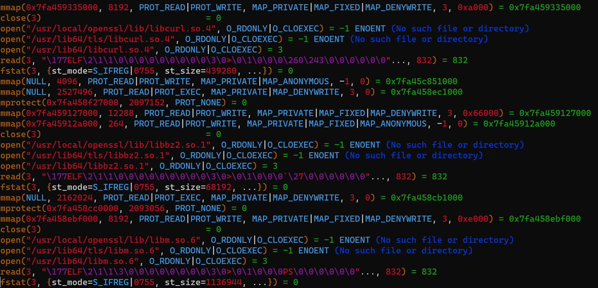
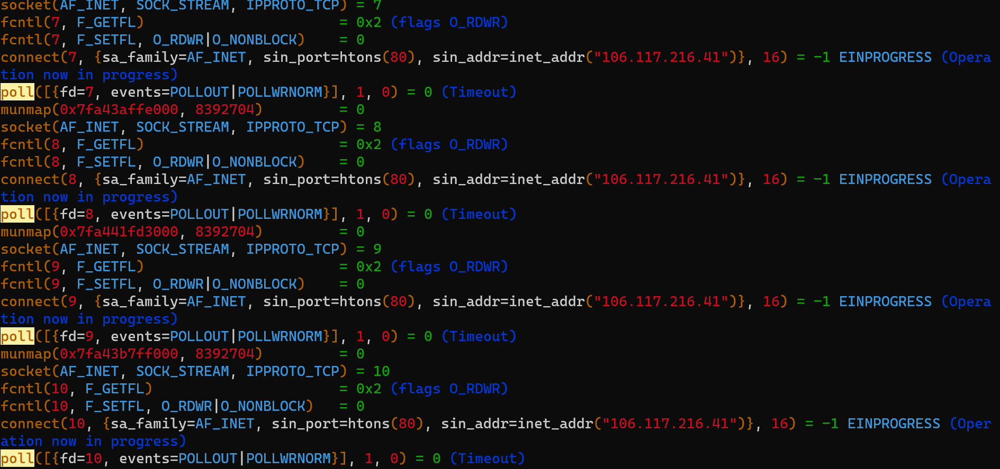
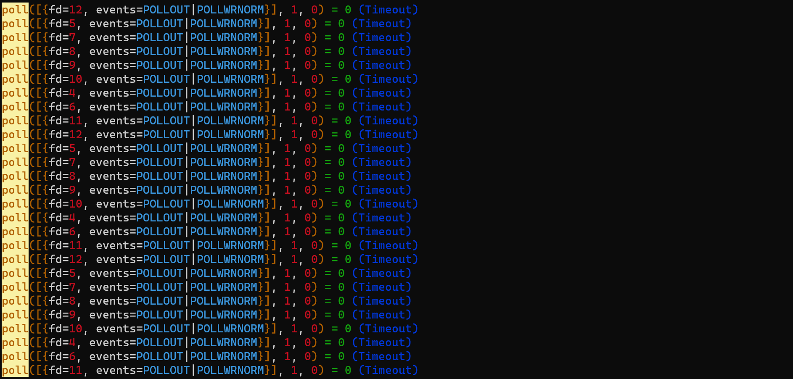
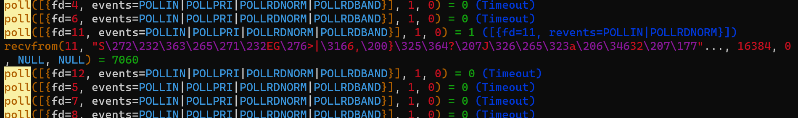

curl_multi 允许你可以并发的发起请求，再来逐个处理响应数据，说简单点就是利用了NIO（异步IO） + select / poll

涉及到的函数

### 1、curl_multi_exec

原型：curl_multi_exec ( resource $mh , int &$still_running ) : int
描述：处理在栈中的每一个句柄。无论该句柄需要读取或写入数据都可调用此方法。
就这，几个人能看懂是啥意思？示例中为何总是将它放在do…while中？
$mh：连接集合。
$still_running：它是个引用，表示连接集合中还有多少个连接没有处理完，此处的处理完包括响应数据接收完毕，或者超时断开，总之就是已经不需要再处理它了。当某个连接数据接收完毕，或者超时断开，那么$still_running的值就会减一。

curl_multi_exec 在不同的时候做不同的事情，从前到后依次是：

- 创建多线程（还不知道干嘛用的）。

  

- 逐个建立连接，发送请求。

  

- 逐个 select / poll。

  

- 接收处理数据，将接收的数据读取到句柄中，改变句柄状态。

  

但是我们无法让它去做什么，而是它根据集合中每个连接处于哪个状态自己决定接下来对该连接做什么，这就是为什么要把它放在do…while中，而终止条件就是$still_running的值。

### 2、curl_multi_select

原型：curl_multi_select ( resource $mh [, float $timeout = 1.0 ] ) : int
描述：阻塞直到cURL批处理连接中有活动连接。
它的作用就是 select / poll ，返回值表示有几个连接有就绪事件，但是它还不如 select ，因为它只告诉我一个数字，却不告诉我哪些句柄，这有什么用？它唯一的作用貌似体现在timeout参数上，是可以阻塞的，防止空转，但是如果curl_multi_exec处于poll阶段，而你又调用了curl_multi_select，岂不是重复发起系统调用了吗？

### 3、curl_multi_info_read

原型：curl_multi_info_read ( resource $mh [, int &$msgs_in_queue = NULL ] ) : array
描述：查询批处理句柄是否单独的传输线程中有消息或信息返回。消息可能包含诸如从单独的传输线程返回的错误码或者只是传输线程有没有完成之类的报告。
我中文不太好，看不太懂！！

它真实的含义是，如果有连接处理完了，$still_running参数减一，同时该连接会被放入一个队列，因此如果$still_running为0，那么队列中元素的个数就是连接的个数。

每次调用 curl_multi_info_read 都会从队列中取出一个，以数组的形式返回，例如：

```php
array(3) {
  ["msg"]=>
  int(1)
  ["result"]=>
  int(0)
  ["handle"]=>
  resource(5) of type (curl)
}
```

此函数也应该放在 while 循环里，将队列取完为止，此时你就可以读取该连接的响应信息，然后将连接移除，关闭。

### 4、curl_multi_getcontent

原型：curl_multi_getcontent ( resource $ch ) : string
描述：如果CURLOPT_RETURNTRANSFER作为一个选项被设置到一个具体的句柄，那么这个函数将会以字符串的形式返回那个cURL句柄获取的内容。
就是读取返回内容。

#### 5、几个常量

```php
CURLM_OK：0
CURLMSG_DONE：1
CURLM_CALL_MULTI_PERFORM：-1
```

根据上面的解释，你似乎可以明白官网的一些例子了，几乎所有的工作都是 curl_multi_exec 做的。

以及这个例子

$active为0就会跳出循环，同时也表明，所有的连接都处理完毕，接下来可以读取数据了。

curl_multi 有两种写法：
1、等待所有的连接都处理完毕再读取数据，或者你也不需要读取数据。

```php
$urls = array(
   "http://www.cnn.com/",
   "http://www.bbc.co.uk/",
   "http://www.yahoo.com/"
);

$mh = curl_multi_init();

foreach ($urls as $i => $url) {
    $conn[$i] = curl_init($url);
    curl_setopt($conn[$i], CURLOPT_RETURNTRANSFER, 1);
    curl_multi_add_handle($mh, $conn[$i]);
}

do {
    $status = curl_multi_exec($mh, $active);
} while ($status === CURLM_CALL_MULTI_PERFORM || $active);

foreach ($urls as $i => $url) {
    $res[$i] = curl_multi_getcontent($conn[$i]);
    curl_close($conn[$i]);
}
```


2、如果有连接处理完毕就立马读取它
```php
do {
    do {
        $mrc = curl_multi_exec($mh, $active);
    } while ($mrc == CURLM_CALL_MULTI_PERFORM);

    while ($done = curl_multi_info_read($mh)) {
        $fileContent = curl_multi_getcontent($done['handle']);
        curl_multi_remove_handle($mh, $done['handle']);
        curl_close($done['handle']);
    }
} while ($active); 
```


完整示例：
```php
$images = [
    'http://videoactivity.bookan.com.cn/1586506139026y8m9vjUIYzykwZzTUY940C05AA84-EA86-48DC-B6F8-B0E8B54B54B5.jpeg',
    'http://videoactivity.bookan.com.cn/15865061392582bXOjQQ9cuJp6VPAsLp49AD00515-9ED4-4B3C-9105-D6A9FE174DDD.jpeg',
    'http://videoactivity.bookan.com.cn/15865061393178TMXKkneQ3K7ECeBpGyd75803A83-F5A4-43BB-A1E8-38EE549441EA.jpeg',
    'http://videoactivity.bookan.com.cn/1586506139377tcqthlvk8NypRXEb6C1Y3758B584-C7A9-442F-A903-AF4800D12E8E.jpeg',
    'http://videoactivity.bookan.com.cn/1586506139456zYIUk8qqcOLHSpCrzlWD0577C380-3EC7-4BA3-9F49-01795B0DA989.jpeg',
    'http://videoactivity.bookan.com.cn/1586506139681VF6h3I8eS9NnC2B65dl4302E2840-4BB4-4CA7-AAAF-AF9EA22B43CA.jpeg',
    'http://videoactivity.bookan.com.cn/1586506140023a6yV2w8ViYnQX7Aj5rznEEB948FB-A3A9-43F3-B701-36F6EEAAB45E.jpeg',
    'http://videoactivity.bookan.com.cn/1586506140324CHSJrMAjzMyO2sfTizSwEEBBE191-B9A5-4203-8DB2-1825B18DCB3B.jpeg',
    'http://videoactivity.bookan.com.cn/1586506140650ll6gZo4dgKEUQb5N1Q1s2FCA6C40-5781-43D4-961F-C86D31361F68.jpeg',
];

function testCurl($images){
    $chArr   = [];
    $nameArr = [];
    $mh      = curl_multi_init();
    foreach ($images as $i => $v) {
        $chArr[$i] = curl_init();
        curl_setopt($chArr[$i], CURLOPT_URL, $v);
        curl_setopt($chArr[$i], CURLOPT_RETURNTRANSFER, 1);
        curl_setopt($chArr[$i], CURLOPT_HEADER, 0);
        curl_setopt($chArr[$i], CURLOPT_TIMEOUT, 0.5);
        curl_multi_add_handle($mh, $chArr[$i]);

        $nameArr[intval($chArr[$i])] = basename($v);
    }
    
    $active = null;
    
    do {
        do {
            $mrc = curl_multi_exec($mh, $active);
        } while ($mrc == CURLM_CALL_MULTI_PERFORM);
    
        while ($done = curl_multi_info_read($mh)) {
            $fileContent = curl_multi_getcontent($done['handle']);
            $name        = $nameArr[intval($done['handle'])];
            file_put_contents("img/2/{$name}", $fileContent);
    
            curl_multi_remove_handle($mh, $done['handle']);
            curl_close($done['handle']);
        }
    
    } while ($active);
    
    curl_multi_close($mh);
}

testCurl($images);

// 追踪系统调用
strace -ff -o out php test.php
```

总结

1. multi_curl是利用了单线程模拟多线程的方式，并非真正意义上的并发请求
2. 对于单个请求仍可使用curl_*进行设置请求信息