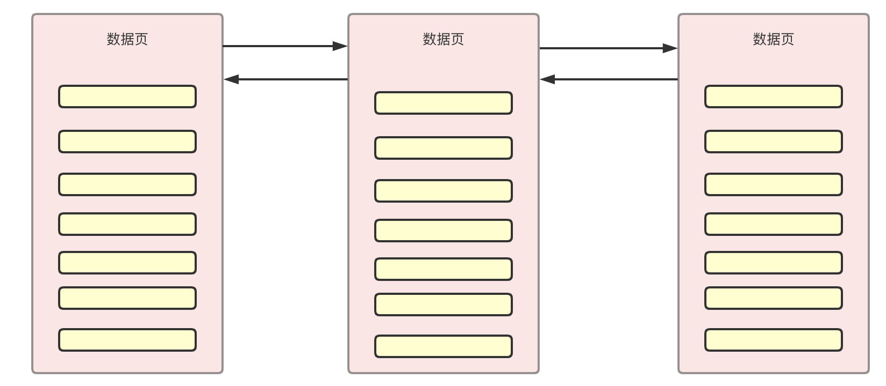
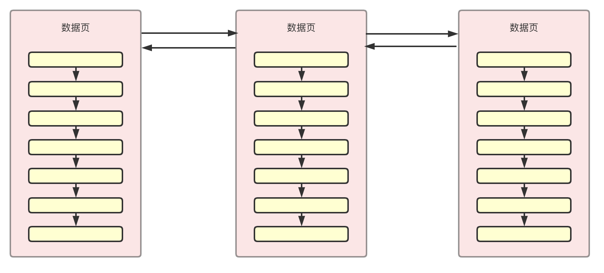
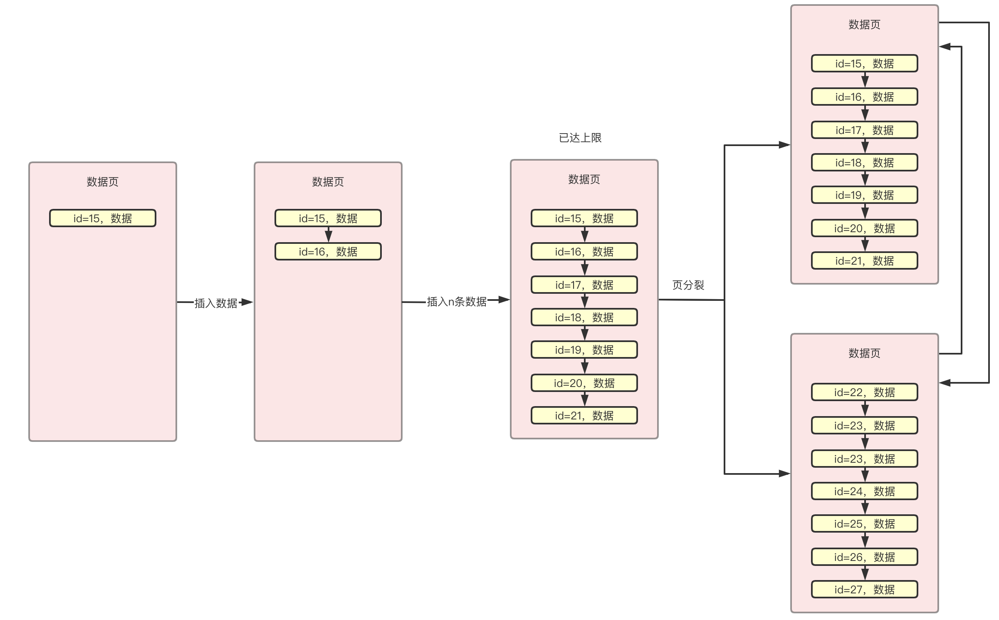
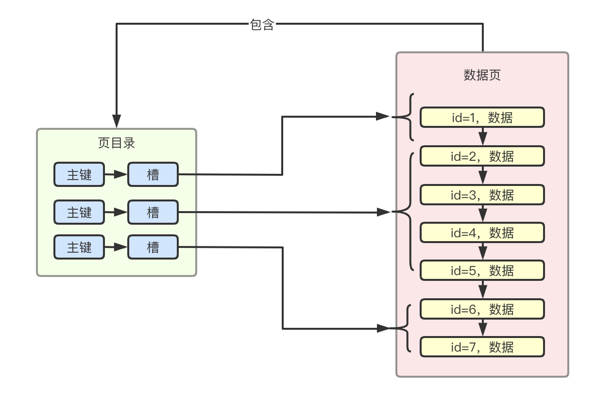
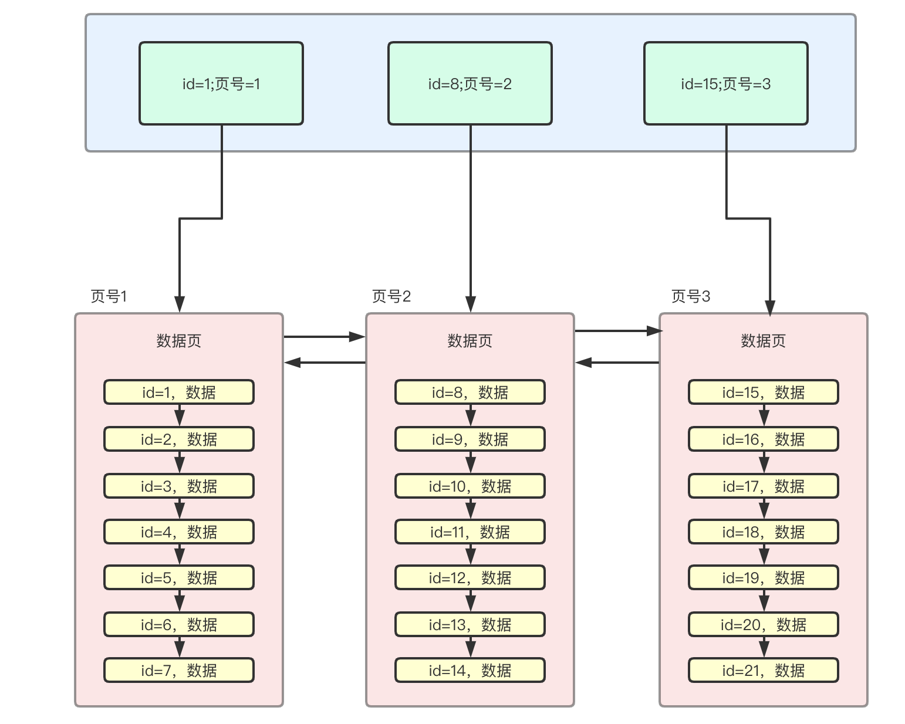
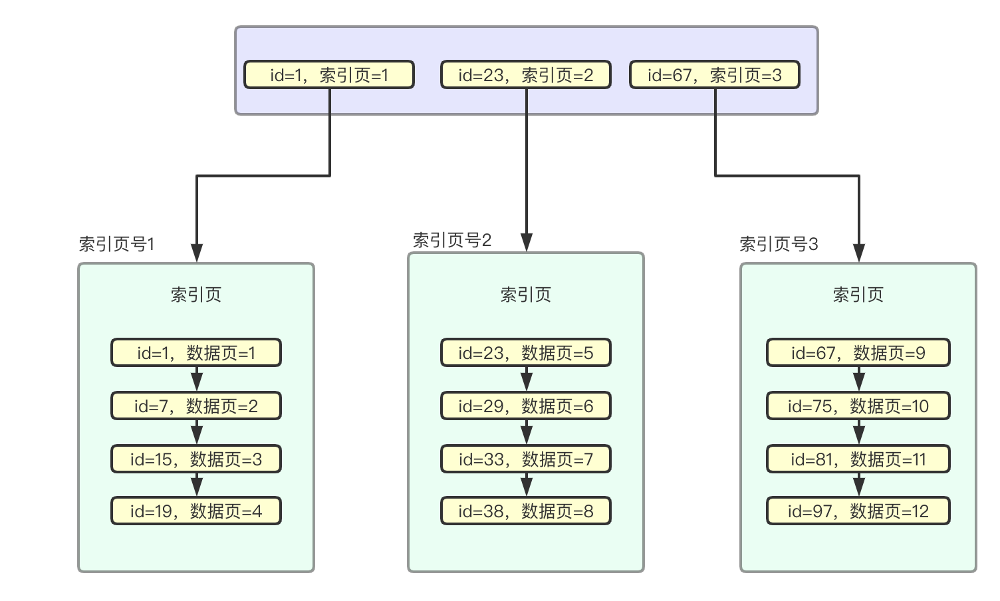
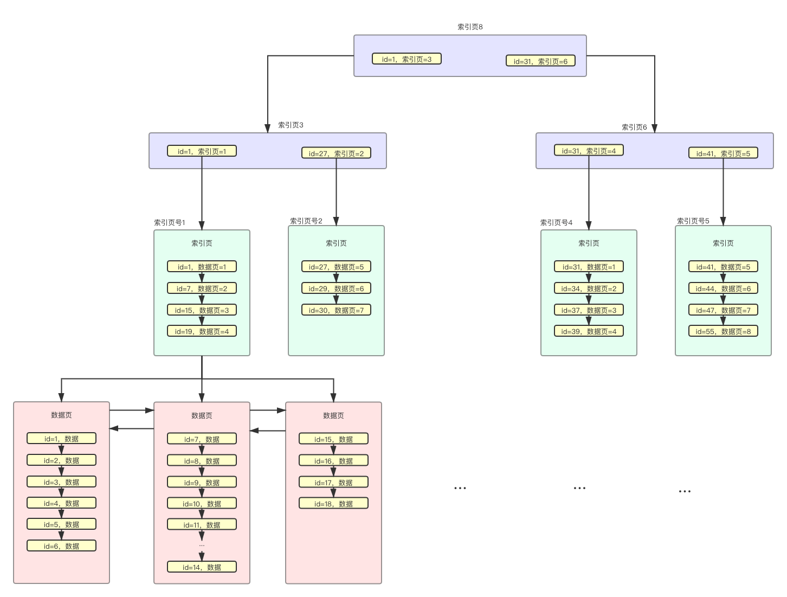
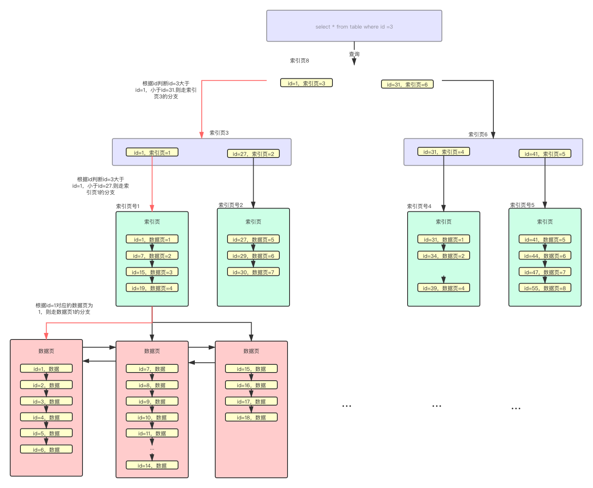

## 引言

​    索引是 Mysql 的一块硬骨头，但是对于程序猿来说又是十分重要的基础技能。在平常的项目开发中，它是重要的 SQL 优化手段。在求职面试中，它是面试官常常用来考察求职者数据库性能优化方面的重要考量。因此透彻的掌握索引原理，并能够将其运用到数据库查询实战是每个程序猿必备的能力。本文将从索引原理、索引设计原则方面阐述 Mysql 索引。相信阅读完本文之后，在 Mysql 索引查询数据理解这块完全可以征服阿里面试官。准备好了吗？我们发车了。

## 索引原理

​    在进行索引设计以及优化之前，我们先深入理解下索引的原理。因为所有的设计以及优化一定是建立在你对原理的透彻理解的基础上。

​    很多人都知道，在进行 SQL 查询时，同样一张表、同样的数据。不加索引以及加索引进行数据查询。两者差别很多。那么到底是为什么有这种差距。简单来说，如果把业务数据比作为一本字典的话，那么索引就是这本字典的目录。如果我让你查一个字，在你不使用目录查的时候，那只能一页一页的翻，运气不好的话可能要翻到最后一页才能查到想要的字，这就是传说中的全表扫描。但是如果我们通过目录来查找，那么可以很快定位字所在页，进而查找到对应的字。看到了吧，索引的威力就在于提高数据查询的效率。好了，现在我们对于索引有了感性的认识。那么我们接下来就深入了解下。

​    我们都知道在 Mysql 中索引的数据结构是 B+树（这里不再说明 B 树、Hash 索引等结构的优劣，不是本文的重点），那么我们就一步一步来看看，索引在磁盘中的 B+树是怎么长成的。

## 1、数据页

​    在日常的项目开发中，我们的业务数据大部分都存在关系型数据中。那么数据库中各个表中的数据最终也都是存储在服务器的硬盘当中的。不知道大家有没有想过这个数据到底是怎么存储的呢？实际上 Mysql 数据库中我们每天都在使用的数据库表是对于人来理解的逻辑表。它实际在磁盘当中是通过一页页的数据页进行存储的。数据页是磁盘与内存交互的基本单位，Mysql 的 Innodb 存储引擎，实际通过 buffer pool 与磁盘中的数据页进行交互，而不是直接操作磁盘中的数据页。数据页的结构如下图所示：

​    同时相邻的数据页之间通过双向链表来维护数据页之间的相互引用。如下图所示，橙红色部分即为数据页，中间的小框框可以理解为一条条具体的数据。Mysql 的 InnoDB 存储引擎数据页大小是 16KB。Mysql 的 Innodb 存储引擎通过页号来唯一定位一个数据页，因此每个数据页都有自己的页号。通过上图可知，每个数据页都有都有对应的 Page Header，在 Page Header 中保存了当前数据页的页号，以及其下一页的页号和上一页的页号。

​    相邻的数据之间通过指针进行互相引用，指针标注数据页的页号，每个数据页中存储了连续的一段数据，每个数据行中的记录头部存有下一行记录真实数据的地址偏移量，简单理解为拥有指针指向下一行数据的地址。因此在数据页的内部，实际是关于数据行的单向链表。这个单向链表是关于主键 id 的，从小到大进行排列。

​    从上述的数据页结构可知，每次进行数据插入时 User Records 区域就会变大，相应的的 User Record 区域就会减少。当 User Record 区域消耗完之后，就会发生页分裂，形成新的数据页。这里需要注意的是，如果我们使用的是 Mysql 中的自增主键，那么可以保证按照 id 的增长顺序进行数据行排列，但是如果主键是我们自己设置的并不是自增长的，那么有可能出现后面插入的数据的主键值小于前面数据的主键值，那么在进行页分裂的时候，Mysql 会按照主键大小重新进行排列。此处不知道大家有没有疑问，为什么一定要按照主键大小进行排列呢？实际上和后续的数据查询有关系，数据页中的数据按照主键顺序进行排列是索引可以正常运行的基础。大致的过程如下图所示：

## 2、页目录

​    每个数据页都有自己的页目录上面页结构中的 Page Directory，这个页目录的作用实际上就是用来进行数据行定位的。数据页中的数据实际上是按组分配的，页目录中的不同的槽位，其实是对应了数据页中的不同的分组，查询数据时，通过 id 找到对应的槽，再根据对应的槽来知道对应在数据页中的数据行分组，遍历数据行分组中的数据直到找到对应的数据。

## 3、索引原理分析

### （1）索引基础

​    有了上面两节的数据页的基础知识之后，我们再来探讨索引原理就更加容易理解了。在没有索引时，数据查询都是进行全表扫描。遍历查询数据页中的每个数据行，再遍历所有的数据页，知道找到符合条件的数据项。因此查询效率十分的低下。那么应该怎么才能提供数据查询的效率呢？能不能像字典的目录一样，也搞个主键目录来进行数据页号的定位呢？答案是肯定的，Mysql 实际也正是这么做的。Mysql 通过主键目录实际就是传说中的主键索引，实现数据的查询优化。在主键目录中包含了两个重要元素，一个是数据页中最小的主键，另一个是当前数据页的页号。这样可以通过这个主键目录方面的进行数据查询。

​    举个栗子，如果此时想要查询主键 id=5 的数据，那么首先在主键目录中进行查找。此时发现主键 id=5 大于主键 id=1，但是又小于 id=8，那么就可以确定实际上数据实际是在页号为 1 的数据页中的。

​    当然在实际在 Mysql 中会有很多的数据页，因此对应的主键索引也会很多，那么此时就需要通过二分查找的方式进行数据页定位，再查找到对应的数据。

### （2）索引页

如今当下，各个互联网公司迅猛发展，对应的业务量也是十分巨大。因此数据库中的数据量也是十分庞大的。表中的数据几百万、上千万可能很常见，按照上述的主键目录，那么就需要存储大量的主键与数据页号。即便是进行二分查找，其数据查询效率也是比较低的。

Mysql 实际是将索引说句存储在索引页中的，当数据量比较大时候，对应的索引也会比较多，因此通过专门的索引页来存储索引数据。另外在这些索引页的上层又通过主键与索引页号来继续进行索引页的查询定位，因此我们得到如下的结构。其中的 id 号指的是对应最小的 id 号。

​    如果索引页中的数据越来越多，索引页同样会进行页分裂。这样索引页也就形成了不同的层级，索引页层、索引页、数据页这三个页数据就形成了我们说的 B+树。下图就是索引的 B+树结构，通过它完成数据查询效率远高于全表扫描。B+的叶子节点才会存储数据，下图是一种主键索引，也叫聚簇索引。其实我们可以看出来，它的根本思想就是分而治之的思想。数据量很大是吧，那我就把数据分成很多的数据页，数据页很多是吧，那我就通过索引页来组织数据页，索引页很多是吧，那就再通过索引页来索引。

​    我们再来看下，数据查询在`B+`树中的查询过程。举个栗子，如当前需要查询 id 为 3 的数据，那么将在索引页中判断应该走索引页为 3 的索引页。那么在索引页为`3`中继续判断`id=1`应该走索引页为 1 的索引页，在索引页中判断应该页号为`1`的数据页，在此数据页中遍历最终查询到对应的数据。

以上通过索引页与数据页组成的 B+树就是聚簇索引，当然我们也可以通过其他字段来建立普通索引。知识普通索引会的叶子节点存储的是对应的主键 id，而不是具体的数据，索引会存在回表的问题，即查询到对应的 id 之后，还需要根据 id 继续到聚簇索引中查询具体的数据，通过这样的操作才能查询到 select *的所有数据。当然我们可以通过覆盖索引的方式避免这样的查询浪费。

# 总结

本文通过一步步图解的方式，为大家拆解 Mysql 的 InnoDB 的索引原理，同时构建出对应的 B+树索引结构。阐述了数据查询的具体过程。相信大家对于索引这块有了更加深刻的理解，后面会从实战的角度出发，分析下如何设计索引以及如何应对索引失效的问题。