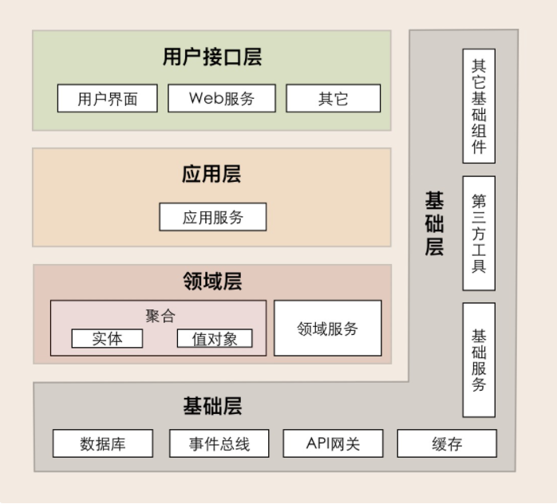

DDD 分层架构模型。它包括用户接口层、应用层、领域层和基础层，分层架构各层的职责边界非常清晰，又能有条不紊地分层协作。

- 用户接口层：面向前端提供服务适配，面向资源层提供资源适配。这一层聚集了接口适配相关的功能。

- 应用层职责：实现服务组合和编排，适应业务流程快速变化的需求。这一层聚集了应用服务和事件相关的功能。

- 领域层：实现领域的核心业务逻辑。这一层聚集了领域模型的聚合、聚合根、实体、值对象、领域服务和事件等领域对象，以及它们组合所形成的业务能力。

- 基础层：贯穿所有层，为各层提供基础资源服务。这一层聚集了各种底层资源相关的服务和能力。

业务逻辑从领域层、应用层到用户接口层逐层封装和协作，对外提供灵活的服务，既实现了各层的分工，又实现了各层的协作。因此，毋庸置疑，DDD 分层架构模型就是设计微服务代码模型的最佳依据。