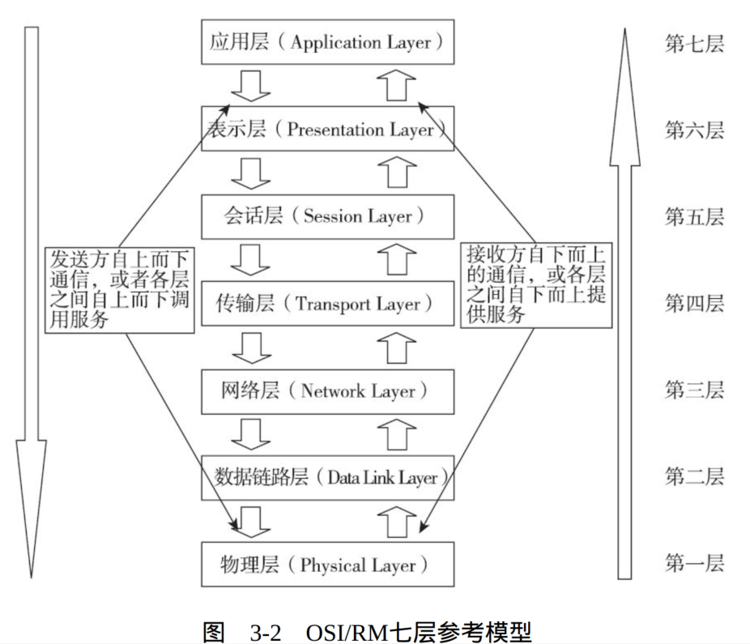
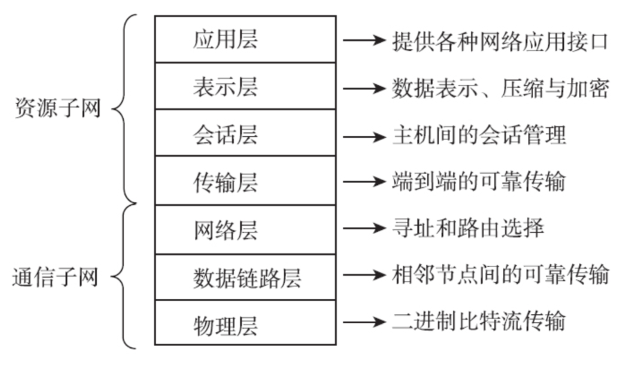
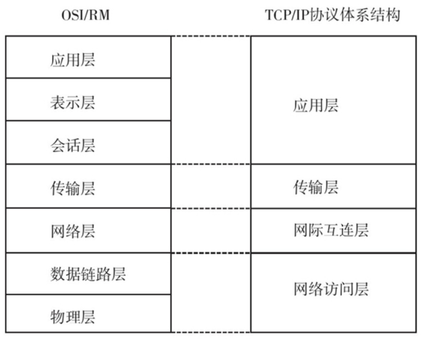
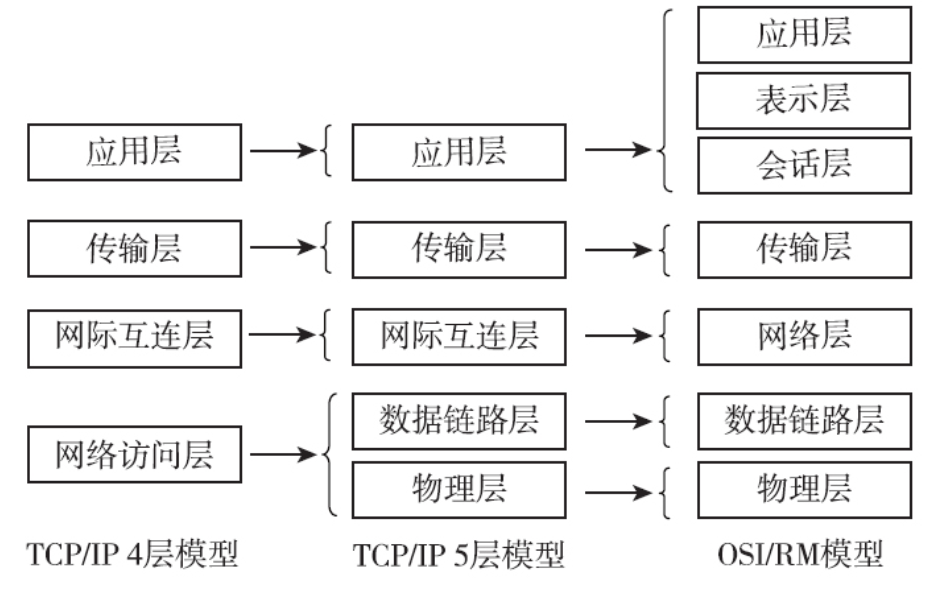

1983年，DARPA将ARPANET上的所有计算机结构转向了TCP/IP协议，并以ARPANET为主干建立和发展了Internet，形成了TCP/IP体系结构。

TCP/IP协议体系结构虽然不是国际标准，但它的发展和应用都远远超过了OSI/RM，成为了Internet体系结构上的实际标准。究其原因主要有以下三个方面：一是TCP/IP协议簇非常庞大，功能完善且实用（目前的Internet基本上全是TCP/IP协议类型的网络），用户基础好；二是曾经的Internet的投资者不会轻易放弃在TCPIP协议体系上的巨大投资；三是OSI/RM的网络体系结构本身分层过多，有些层次（如会话层和表示层）没有太大单独划分的必要性，而有些功能（如流量控制和差错控制等）又在多个层次中出现，实现和协调起来比较难。

“物联网”是一种继续扩展计算机网络的新型技术，简单地讲就是“物-物相联的网”。它是通过射频识别（RFID）技术，以及红外感应器、全球定位系统、激光扫描器等信息传感设备，按约定的协议，把一些目前不能与计算机网络连接的物品（如电灯、电器、监控设施等）与互联网连接，以便进行物品之间的信息交换和通信，实现对物品的智能化识别、定位、跟踪、监控和管理。通过“物联网”我们将来在上班时就可以控制家里的电灯、电器设施的开关，监控家里的防盗监控设施，真正实现无处不在的互联网应用。  

按照传输方式划分网络有以下方式

**1. 点对点传输网络**

​		在点对点传输网络中，数据是以点对点的方式（或者说是“一对一”方式）在计算机或通信设备中传输的，也就是某个端口只能和与它相接、相连的对端端口进行通信，不能把数据发送到本网络的其他链路中，也就是只能单点“联系”。  

**2. 广播式传输网络  **

​		在广播式传输网络中传输信息时，任何一个节点都可以发送数据包，通过公共信道（如交换机的背板矩阵，以及设备间的连接通道）或总线传送到网络中的其他计算机上。然后，这些计算机根据数据包中的目的MAC地址进行判断，如果自己的MAC地址与目的MAC地址匹配则接收（与此同时，发送节点就可以知道与目的IP地址对应的MAC地址，下次接收到包括同样目的IP地址的包时就不用再广播了），否则便丢弃它。  

## 网络拓扑

### 1. 节点

一个“节点”其实就是一个**网络端口**。节点又分为“**转节点**”和“**访问节点**”两类。

“转节点”的作用是支持网络的连接，它通过通信线路转接和传递信息，如交换机、网关、路由器、防火墙设备的各个网络端口等；

“访问节点”是信息交换的源点和目标点，通常是用户计算机上的网卡接口。

如我们在设计一个网络系统时，通常所说的共有××个节点，其实就是在网络中有多个要配置IP地址的网络端口。  

### 2. 结点

一个“结点”是指**一台网络设备**，因为它们通常连接了多个“节点”，所以称之为“结点”。

在计算机网络中的结点又分为链路结点和路由结点，它们就分别对应的是网络中的交换机和路由器。

从网络中的结点数多少就可以大概知道你的计算机网络规模和基本结构了。  

### 3. 链路

​		“链路”是两个节点间的线路。链路分物理链路和逻辑链路（或称数据链路）两种，前者是指实际存在的通信线路，由设备网络端口和传输介质连接实现；后者是指在逻辑上起作用的网络通路，由计算机网络体系结构中的数据链路层标准和协议来实现。如果链路层协议没有起作用，数据链路也就无法建立起来。  

### 4. 通路

​		“通路”从发出信息的节点到接收信息的节点之间的一串节点和链路的组合。也就是说，它是一系列穿越通信网络而建立起来的节点到节点的链路串连。它与“链路”的区别主要在于一条“通路”中可能包括多条“链路”。  

## 计算机网络的标准建立

### OSI/RM 七层结构

在第三代计算机网络中，ISO推出了第一个标准化的计算机网络体系结构——OSI/RM（Open System Interconnection Reference Model，开放系统互连参考模型）。后面又有一些国际组织或公司先后推出了局域网体系结构IEEE 802.1、TCP/IP协议体系结构（虽然至今都没有标准化，但已是事实上的标准）和无线局域网（WLAN）体系结构的IEEE 802.11。  

OSI/RM低四层（从物理层到传输层）定义了如何进行端到端的数据传输，也就是定义了如何通过网卡、物理电缆、交换机和路由器进行数据传输；而高三层（从会话层到应用层）定义了终端系统的应用程序和用户如何彼此通信，也即定义了如何重建从发送方到目的方的应用程序数据流。更多的是把OSI/RM的七层结构分成**低三层和高四层的**，**低三层负责创建网络通信所需的网络连接（面向网络）**，属于“通信子网”部分，**高四层具体负责端到端的用户数据通信（面向用户）**，属于“资源子网”部分。  

**低三层作用**

1. 通过他们自己对应层的信息交换构建数据通信所需的网络平台，通俗说就是**打通一条用于数据传输的网络通道**
2. 为来自上层的数据提供物理的传输通道

低三层均不能识别和处理来自应用层的网络应用数据，仅用于为用户的网络应用数据通信提供通信线路、网络基础架构，或者说是网络通信平台  

**高四层作用**

为各种具体的网络应用提供应用平台和端对端的数据传输通道，对低三层所构建的网络平台可以说是“视而不见”  

### TCP/IP协议体系结构

在TCP/IP协议体系结构中对原来OSI/RM的七层结构进行了进一步的简化，主要体现在以下两个方面：  

1. 把原来的“物理层”和“数据链路层”这两层结构合并为一层，即网络访问层，它提供局域网中的功能；  
2. 合并了原来OSI/RM中的最高的三层，成为新的应用层。因为事实上，在OSI/RM中会话层和表示层的功能都非常单一，完全可以合并到应用层之中。  

一般使用的是TCP/IP 5层模型

### 例说网络体系中各层功能

1. 物理层

   用来构建计算机网络通信和数据传输的通道的，相当于日常交通网络中的各种道路，如公路、铁路和航线，它们是我们出门旅行必须要依靠的基础设施

   物理层不是针对具体的传输介质、设备和通信协议的，因为它们可以有许多种选择（如传输介质中就可以有同轴电缆、双绞线和光纤等），只要能实现物理层的某种功能就行了

2. 数据链路层

   数据链路层为同一局域网内部的网络/数据通信提供点对点的数据传输通道，通过MAC地址寻址把数据转到目的节点，可以理解为我们的市内公路+交通法规

   之所以只能理解为**市内公路**，是因为在**各个网络中的数据链路层间的通信仅可以在同一网段内进行**；之所以还要加上“**交通法规**”，是因为**数据链路层所提供的不再是物理线路，而是在物理层的物理线路基础之上，通过数据链路层协议（相当于市内交通法规）构建的，可真正用于数据传输的虚拟数据传输通道**，但这样的虚拟数据传输通道也**只能在同一网段内进行数据转发**。  

3. 网际互联层（网络层）

   为不同网段之间的数据转发提供路径选择，通过IP地址（也可以是其他网络层地址，要视具体网络类型而定）把数据包转发到目的节点，可以理解为交通网络中的车站、机场、码头

   这涉及一个选择下一站路径的问题，也就相当于我们要到某外地去旅行，到了车站、机场、码头后要选择乘坐哪趟车、哪趟飞机或轮船才能最快捷，成本最低。  

   网络层的功能就相当于连接不
   同网络的桥梁，仅起到在不同网络间转发数据包的作用，最终数据还是要在目的网络的数据链路层进行传输，在到达下一个网络结点设备（如路由器）时再进行路由、转发。  

4. 传输层

   在下面三层构建的网络平台基础上专门为通信双方构建端对端（不是点对点）的数据传输通道，使通信双方就像直接进行数据传输一样。这个端对端传输通道是可以跨网络的，这与数据链路层所构建的仅用于局域网内部的点对点传输通道是不同的。  

   传输层类似于国际航线，一条国际航线可能要经过几个国家，但国际航班飞机飞行时根本不用考虑经过了哪些国家的航线，因为这些事先在确立国际航线时就已处理好了，就像一条传输通道要经过几个网络不用管一样，因为网络层事先已准备好了通信路径。  

5. 应用层（会话层、表示层、应用层）

   而在TCP/IP协议体系结构中是没有这两层的，那是因为TCP/IP协议是专门针对TCP/IP协议类型网络而开发的体系结构，不存在其他网络类型，所以不需要表示层，会话层的作用因为太单一，所以合并到了应用层中。

   **会话层**为具体的用户应用建立会话进程（每个应用都有一个会话进程），这个过程是一个用户网络应用的协商过程，相当于车站、机场或码头中总调度人员所从事的调度工作。

   **表示层**是对用户网络应用数据的具体解释，包括在网络通信时可采用的信息格式、可采用的加密方式，相当于车站、机场、码头中发送每一班次汽车、火车、轮船的具体文件，包括所采用的车型、机型、船型，以及所负责的运输公司、交接人员名单等内容。  

   **应用层**是用户进行具体网络应用的层次，是具体网络应用的体现者。应用层负责接受用户的各种网络应用进程的调用，相当于车站、机场和码头的负责人负责接受乘客运输的调度，确定具体班次的发送时间和要完成的任务。  

